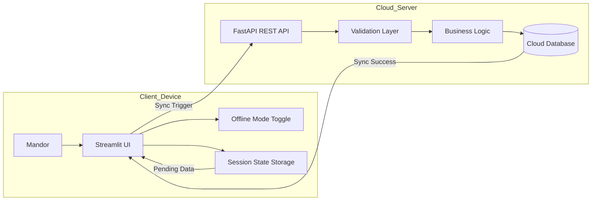

# Cloud App - E-Mandor

Aplikasi e-Mandor merupakan sistem informasi berbasis cloud computing dengan pendekatan Progressive Web App (PWA) yang dirancang untuk mendigitalisasi pencatatan hasil panen kelapa sawit di tingkat afdeling. Sistem ini ditujukan bagi mandor panen sebagai pengguna utama untuk menginput data absensi, jumlah janjang, dan brondolan secara langsung melalui perangkat seluler, serta bagi staf administrasi (krani) untuk memantau laporan produksi harian secara real-time. Dengan dukungan arsitektur cloud-native dan fitur sinkronisasi offline-to-cloud, aplikasi ini tetap dapat digunakan di area perkebunan yang memiliki keterbatasan jaringan internet.

Pengembangan e-Mandor bertujuan mengatasi berbagai kendala pencatatan manual berbasis kertas yang selama ini rentan terhadap kerusakan dokumen, kesalahan rekapitulasi, serta keterlambatan pelaporan. Melalui otomatisasi proses rekap dan perhitungan estimasi premi secara instan, sistem ini meningkatkan efisiensi operasional sekaligus memperkuat akurasi data produksi. Selain mempercepat alur informasi dari kebun ke manajemen, e-Mandor juga mendorong transparansi pengupahan sehingga dapat meminimalkan potensi kesalahan perhitungan dan sengketa antara pekerja dan perusahaan.

## 👥 Identitas Tim

| Nama | NIM | Peran |
|------|-----|-------|
| Adam Ibnu Ramadhan | 10231003 | Lead Backend |
| Alfian Fadillah Putra | 10231009 | Lead Frontend |
| Varrel Kaleb Ropard Pasaribu | 10231089 | Lead Container |
| Adhyasta Firdaus | 10231005 | Lead CI/CD & Deploy |
| Adonia Azarya Tamalonggehe | 10231007 | Lead QA & Docs |

## Architecture Overview



## Tech Stack

- **Frontend**: React, Vite, Tailwind CSS
- **Backend**: FastAPI, Python
- **Database**: Cloud-native database (e.g., PostgreSQL, Firebase)
- **Deployment**: Cloud-based (e.g., AWS, GCP, Azure)
- **Other Tools**: Streamlit for UI, Progressive Web App (PWA) features

## API Endpoints

Aplikasi menyediakan beberapa endpoint REST API yang dapat diakses melalui backend server:

### Health & Info Endpoints

- **GET `/`** - Root endpoint, mengembalikan informasi API
- **GET `/team`** - Mengembalikan informasi tim dan anggota-anggotanya

**Contoh response dari `/team`:**

```json
{
  "team": "cloud-team-a-awit",
  "members": [
    {
      "name": "Adam Ibnu Ramadhan",
      "nim": "10231003",
      "role": "Lead Backend"
    },
    {
      "name": "Alfian Fadillah Putra",
      "nim": "10231009",
      "role": "Lead Frontend"
    },
    {
      "name": "Varrel Kaleb Ropard Pasaribu",
      "nim": "10231089",
      "role": "Lead Container"
    },
    {
      "name": "Adhyasta Firdaus",
      "nim": "10231005",
      "role": "Lead CI/CD & Deploy"
    },
    {
      "name": "Adonia Azarya Tamalonggehe",
      "nim": "10231007",
      "role": "Lead QA & Docs"
    }
  ]
}
```

## 📁 Struktur Proyek

```
cc-kelompok-a-awit/
├── README.md                 # Dokumentasi proyek
├── backend/                  # Backend API (FastAPI)
│   ├── main.py              # Main application file
│   ├── requirements.txt      # Python dependencies
│   └── __pycache__/         # Python cache
├── frontend/                 # Frontend application (React + Vite)
│   ├── src/
│   │   ├── App.jsx         # Main React component
│   │   ├── main.jsx        # Entry point
│   │   ├── App.css         # Styling
│   │   ├── index.css       # Global styles
│   │   └── assets/         # Static assets
│   ├── public/             # Public files
│   ├── package.json        # NPM dependencies
│   ├── vite.config.js      # Vite configuration
│   ├── eslint.config.js    # ESLint configuration
│   └── index.html          # HTML template
└── docs/                    # Dokumentasi tim
    └── member-*.md         # File data member tim

```

## Getting Started

### Prerequisites

Pastikan sudah menginstall berikut pada sistem Anda:

- **Node.js** (v16 atau lebih baru) - [Download](https://nodejs.org/)
- **Python** (v3.9 atau lebih baru) - [Download](https://www.python.org/)
- **pip** (Python package manager) - biasanya sudah ter-include dengan Python
- **Virtual environment tool** (venv atau virtualenv)
- **Git** - untuk clone repository

### 1. Clone Repository

```bash
git clone https://github.com/aidilsaputrakirsan-classroom/cc-kelompok-a-awit.git
cd cc-kelompok-a-awit
```

### 2. Setup Backend

```bash
cd backend

# Buat virtual environment
python -m venv venv

# Aktifkan virtual environment
# Windows:
venv\Scripts\activate
# Linux/macOS:
# source venv/bin/activate

# Install dependencies
pip install -r requirements.txt
```

### 3. Setup Frontend

```bash
cd ../frontend

# Install dependencies
npm install

# (Opsional) Untuk development dengan HMR
npm.run dev
```

## Menjalankan Aplikasi

### Menjalankan Backend Server

```bash
cd backend

# Aktifkan virtual environment jika belum aktif
# Windows: venv\Scripts\activate
# Linux/macOS: source venv/bin/activate

# Jalankan FastAPI server
uvicorn main:app --reload --port 8000
```

Server akan berjalan di `http://localhost:8000`

**Endpoints yang tersedia:**
- `http://localhost:8000/` - Root endpoint
- `http://localhost:8000/team` - Team information

### Menjalankan Frontend Development Server

```bash
cd frontend

# Jalankan Vite development server
npm run dev
```

Buka browser dan akses URL yang ditunjukkan di terminal (biasanya `http://localhost:5173`)

### Verifikasi Koneksi

Untuk memastikan frontend dan backend sudah terhubung dengan baik:

1. Buka browser ke `http://localhost:8000/team` untuk melihat informasi tim
2. Aplikasi frontend seharusnya dapat melakukan fetch data dari API backend di port 8000

## Deployment

Panduan deployment ke cloud, CI/CD pipelines, dan konfigurasi produksi akan ditambahkan di sini.

## 📚 Dokumentasi Lanjutan

- Dokumentasi API interaktif tersedia di `http://localhost:8000/docs` saat server backend berjalan
- Untuk menambahkan endpoint baru, edit file `backend/main.py`
- Untuk mengubah tampilan frontend, edit file di folder `frontend/src/`


