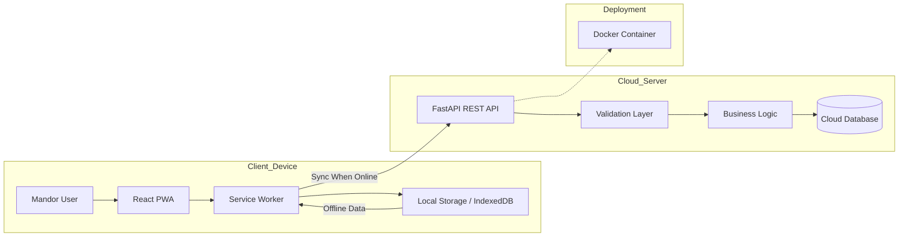

> Dokumentasi awal disusun oleh Lead DevOps dan telah direview serta difinalisasi oleh Lead QA & Documentation.
# Cloud App – E-Mandor

Aplikasi **e-Mandor** merupakan sistem informasi berbasis **Cloud Computing** dengan pendekatan **Progressive Web App (PWA)** yang dirancang untuk mendigitalisasi pencatatan hasil panen kelapa sawit di tingkat afdeling.

Sistem ini memungkinkan:

* Mandor melakukan input absensi, jumlah janjang, dan brondolan melalui perangkat seluler.
* Krani/administrasi memantau laporan produksi harian secara real-time.
* Sinkronisasi data dari mode offline ke cloud ketika jaringan tersedia.

Dengan arsitektur cloud-native, e-Mandor meningkatkan efisiensi operasional, akurasi data, serta transparansi proses pengupahan.

---

# Identitas Tim

| Nama                         | NIM      | Peran                   |
| ---------------------------- | -------- | ----------------------- |
| Adam Ibnu Ramadhan           | 10231003 | Lead Backend            |
| Adhyasta Firdaus             | 10231005 | Lead CI/CD & Deployment |
| Adonia Azarya Tamalonggehe   | 10231007 | Lead QA & Documentation |
| Alfian Fadillah Putra        | 10231009 | Lead Frontend           |
| Varrel Kaleb Ropard Pasaribu | 10231089 | Lead DevOps             |

---

# Architecture Overview



Arsitektur ini menerapkan pendekatan **client–server berbasis REST API** dengan dukungan mode offline pada sisi frontend dan penyimpanan terpusat di cloud database.

---

# Tech Stack

### Frontend

* React
* Vite
* Tailwind CSS
* Progressive Web App (PWA)

### Backend

* FastAPI (Python)
* Uvicorn

### Database

* Cloud-native database (PostgreSQL / Firebase)

### DevOps & Deployment

* Docker & Docker Compose
* CI/CD Pipeline
* Cloud Platform (AWS / GCP / Azure)

---

# 🔌 API Endpoints

### Health & Info

| Method | Endpoint | Deskripsi     |
| ------ | -------- | ------------- |
| GET    | `/`      | Root endpoint |
| GET    | `/team`  | Informasi tim |

### Contoh Response `/team`

```json
{
  "team": "cloud-team-a-awit",
  "members": [
    { "name": "Adam Ibnu Ramadhan", "nim": "10231003", "role": "Lead Backend" },
    { "name": "Adhyasta Firdaus", "nim": "10231005", "role": "Lead CI/CD & Deployment" },
    { "name": "Adonia Azarya Tamalonggehe", "nim": "10231007", "role": "Lead QA & Documentation" },
    { "name": "Alfian Fadillah Putra", "nim": "10231009", "role": "Lead Frontend" },
    { "name": "Varrel Kaleb Ropard Pasaribu", "nim": "10231089", "role": "Lead DevOps" }
  ]
}
```

---

# Struktur Proyek

```
cc-kelompok-a-awit/
├── README.md
├── backend/
│   ├── main.py
│   ├── requirements.txt
├── frontend/
│   ├── src/
│   ├── public/
│   ├── package.json
│   ├── vite.config.js
└── docs/
```

---

# Getting Started

## Prerequisites

* Node.js (v16+)
* Python (v3.9+)
* pip
* Git
* Docker (opsional untuk container)

---

## 1️⃣ Clone Repository

```bash
git clone https://github.com/aidilsaputrakirsan-classroom/cc-kelompok-a-awit.git
cd cc-kelompok-a-awit
```

---

## 2️⃣ Setup Backend

```bash
cd backend
python -m venv venv

# Windows
venv\Scripts\activate

pip install -r requirements.txt
uvicorn main:app --reload --port 8000
```

Backend berjalan di:

```
http://localhost:8000
```

---

## 3️⃣ Setup Frontend

```bash
cd frontend
npm install
npm run dev
```

Frontend biasanya berjalan di:

```
http://localhost:5173
```

---

# Containerization

Aplikasi menggunakan Docker untuk memastikan konsistensi environment antara development dan production.

Service utama:

* Backend (FastAPI)
* Frontend (React)
* Database (opsional)

Docker Compose memungkinkan seluruh service berjalan dalam satu network terisolasi.

---

# Deployment

Panduan CI/CD dan deployment ke cloud platform akan ditambahkan pada tahap produksi.

---

# Peer Review & Quality Assurance

Dokumentasi ini telah melalui proses **peer review internal** untuk memastikan kualitas dan konsistensi.

## Proses QA

1. Setiap Lead menyusun bagian sesuai tanggung jawab.
2. Review silang dilakukan oleh anggota tim.
3. Lead QA & Docs melakukan final validation sebelum merge ke branch utama.

## Checklist Validasi

* [x] Identitas tim lengkap
* [x] Arsitektur dijelaskan dengan diagram
* [x] Tech stack konsisten
* [x] API terdokumentasi
* [x] Instruksi instalasi dapat dijalankan
* [x] Struktur proyek jelas

---

# Dokumentasi Tambahan

* Dokumentasi API interaktif tersedia di:

```
http://localhost:8000/docs
```

* Perubahan backend: `backend/main.py`
* Perubahan frontend: `frontend/src/`

---

# Status Proyek

🚧 Project dalam tahap pengembangan aktif.
Fitur dan dokumentasi akan terus diperbarui seiring progres implementasi.

---
## Kontribusi Peran

Sebagai Lead QA & Documentation, tanggung jawab yang dilakukan meliputi:
- Review dan konsistensi struktur README
- Validasi kesesuaian Tech Stack dan arsitektur
- Perbaikan kesalahan sintaks dan command
- Standardisasi format dokumentasi
- Finalisasi dokumen sebelum publish