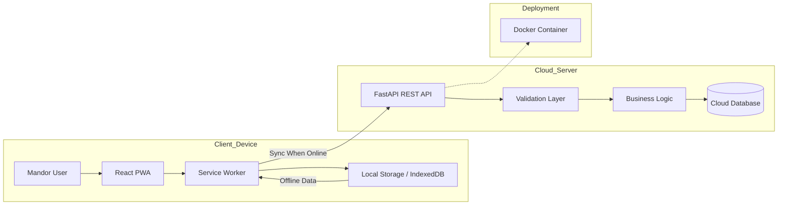
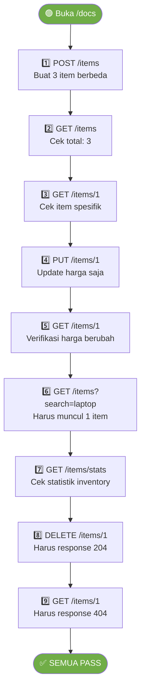

> Dokumentasi awal disusun oleh Lead DevOps dan telah direview serta difinalisasi oleh Lead QA & Documentation.
# Cloud App – E-Mandor

Aplikasi **e-Mandor** merupakan sistem informasi berbasis **Cloud Computing** dengan pendekatan **Progressive Web App (PWA)** yang dirancang untuk mendigitalisasi pencatatan hasil panen kelapa sawit di tingkat afdeling.

Sistem ini memungkinkan:

* Mandor melakukan input absensi, jumlah janjang, dan brondolan melalui perangkat seluler.
* Krani/administrasi memantau laporan produksi harian secara real-time.
* Sinkronisasi data dari mode offline ke cloud ketika jaringan tersedia.

Dengan arsitektur cloud-native, e-Mandor meningkatkan efisiensi operasional, akurasi data, serta transparansi proses pengupahan.

---

# Identitas Tim

| Nama                         | NIM      | Peran                   |
| ---------------------------- | -------- | ----------------------- |
| Adam Ibnu Ramadhan           | 10231003 | Lead Backend            |
| Adhyasta Firdaus             | 10231005 | Lead CI/CD & Deployment |
| Adonia Azarya Tamalonggehe   | 10231007 | Lead QA & Documentation |
| Alfian Fadillah Putra        | 10231009 | Lead Frontend           |
| Varrel Kaleb Ropard Pasaribu | 10231089 | Lead DevOps             |

---

# Architecture Overview



Arsitektur ini menerapkan pendekatan **client–server berbasis REST API** dengan dukungan mode offline pada sisi frontend dan penyimpanan terpusat di cloud database.

---

# Tech Stack

### Frontend

* React
* Vite
* Tailwind CSS
* Progressive Web App (PWA)

### Backend

* FastAPI (Python)
* Uvicorn

### Database

* Cloud-native database (PostgreSQL / Firebase)

### DevOps & Deployment

* Docker & Docker Compose
* CI/CD Pipeline
* Cloud Platform (AWS / GCP / Azure)

---

# 🔌 API Endpoints

## Base URL

```
http://localhost:8000
```

Swagger UI (dokumentasi interaktif):

```
http://localhost:8000/docs
```

---

## Ringkasan Endpoint

| No | Method   | Endpoint           | Deskripsi                              | Status Code       |
|----|----------|--------------------|----------------------------------------|-------------------|
| 1  | `GET`    | `/health`          | Cek status API                         | 200               |
| 2  | `GET`    | `/team`            | Informasi tim                          | 200               |
| 3  | `POST`   | `/items`           | Buat item baru                         | 201               |
| 4  | `GET`    | `/items`           | Ambil semua item (pagination & search) | 200               |
| 5  | `GET`    | `/items/{item_id}` | Ambil satu item berdasarkan ID         | 200 / 404         |
| 6  | `PUT`    | `/items/{item_id}` | Update item berdasarkan ID             | 200 / 404         |
| 7  | `DELETE` | `/items/{item_id}` | Hapus item berdasarkan ID              | 204 / 404         |
| 8  | `GET`    | `/items/stats`     | Statistik inventory                    | 200               |

---

# 1️⃣ Health Check

**Method**

```
GET
```

**Endpoint**

```
/health
```

**Deskripsi**

Mengecek apakah server API sedang berjalan dengan baik.

**Response Example (200 OK)**

```json
{
  "status": "healthy",
  "version": "0.2.0"
}
```

---

# 2️⃣ Team Information

**Method**

```
GET
```

**Endpoint**

```
/team
```

**Deskripsi**

Menampilkan informasi seluruh anggota tim beserta peran masing-masing.

**Response Example (200 OK)**

```json
{
  "team": "cloud-team-a-awit",
  "members": [
    {
      "name": "Adam Ibnu Ramadhan",
      "nim": "10231003",
      "role": "Lead Backend"
    },
    {
      "name": "Adhyasta Firdaus",
      "nim": "10231005",
      "role": "Lead CI/CD & Deployment"
    },
    {
      "name": "Adonia Azarya Tamalonggehe",
      "nim": "10231007",
      "role": "Lead QA & Documentation"
    },
    {
      "name": "Alfian Fadillah Putra",
      "nim": "10231009",
      "role": "Lead Frontend"
    },
    {
      "name": "Varrel Kaleb Ropard Pasaribu",
      "nim": "10231089",
      "role": "Lead DevOps"
    }
  ]
}
```

---

# 3️⃣ Create Item

**Method**

```
POST
```

**Endpoint**

```
/items
```

**Deskripsi**

Membuat item baru dan menyimpannya ke database.

**Request Body**

| Field         | Type    | Required | Validasi                   | Deskripsi            |
|---------------|---------|----------|----------------------------|----------------------|
| `name`        | string  | ✅ Ya    | min 1, max 100 karakter    | Nama item            |
| `price`       | float   | ✅ Ya    | harus > 0                  | Harga item           |
| `description` | string  | ❌ Tidak | —                          | Deskripsi item       |
| `quantity`    | integer | ❌ Tidak | default `0`, tidak negatif | Jumlah stok          |

**Request Body Example**

```json
{
  "name": "Laptop",
  "price": 15000000,
  "description": "Laptop untuk cloud computing",
  "quantity": 5
}
```

**Response Example (201 Created)**

```json
{
  "id": 1,
  "name": "Laptop",
  "description": "Laptop untuk cloud computing",
  "price": 15000000,
  "quantity": 5,
  "created_at": "2026-03-07T10:30:00",
  "updated_at": null
}
```

**Error Response (422 Unprocessable Entity)** — validasi gagal, misalnya `price` bernilai negatif:

```json
{
  "detail": [
    {
      "type": "greater_than",
      "loc": ["body", "price"],
      "msg": "Input should be greater than 0",
      "input": -5000
    }
  ]
}
```

---

# 4️⃣ Get All Items

**Method**

```
GET
```

**Endpoint**

```
/items
```

**Deskripsi**

Mengambil daftar semua item dengan dukungan pagination dan pencarian berdasarkan nama atau deskripsi.

**Query Parameters**

| Parameter | Type    | Default | Batas      | Deskripsi                                  |
|-----------|---------|---------|------------|--------------------------------------------|
| `skip`    | integer | `0`     | ≥ 0        | Jumlah data yang di-skip (offset)          |
| `limit`   | integer | `20`    | 1 – 100    | Jumlah item yang dikembalikan per halaman  |
| `search`  | string  | —       | —          | Kata kunci pencarian (nama atau deskripsi) |

**Example Request**

```
GET /items?skip=0&limit=10
```

```
GET /items?search=laptop
```

**Response Example (200 OK)**

```json
{
  "total": 2,
  "items": [
    {
      "id": 2,
      "name": "Mouse Wireless",
      "description": "Mouse bluetooth",
      "price": 250000,
      "quantity": 20,
      "created_at": "2026-03-07T10:35:00",
      "updated_at": null
    },
    {
      "id": 1,
      "name": "Laptop",
      "description": "Laptop untuk cloud computing",
      "price": 15000000,
      "quantity": 5,
      "created_at": "2026-03-07T10:30:00",
      "updated_at": null
    }
  ]
}
```

> **Catatan:** Item diurutkan berdasarkan `created_at` terbaru terlebih dahulu (descending).

---

# 5️⃣ Get Item By ID

**Method**

```
GET
```

**Endpoint**

```
/items/{item_id}
```

**Path Parameter**

| Parameter | Type    | Deskripsi              |
|-----------|---------|------------------------|
| `item_id` | integer | ID unik item di database |

**Example Request**

```
GET /items/1
```

**Response Example (200 OK)**

```json
{
  "id": 1,
  "name": "Laptop",
  "description": "Laptop untuk cloud computing",
  "price": 15000000,
  "quantity": 5,
  "created_at": "2026-03-07T10:30:00",
  "updated_at": null
}
```

**Error Response (404 Not Found)** — item tidak ditemukan:

```json
{
  "detail": "Item dengan id=1 tidak ditemukan"
}
```

---

# 6️⃣ Update Item

**Method**

```
PUT
```

**Endpoint**

```
/items/{item_id}
```

**Deskripsi**

Memperbarui sebagian atau seluruh field dari item tertentu berdasarkan ID.  
Hanya field yang dikirim dalam request body yang akan diperbarui (**partial update**).

**Path Parameter**

| Parameter | Type    | Deskripsi              |
|-----------|---------|------------------------|
| `item_id` | integer | ID unik item di database |

**Request Body** — semua field bersifat opsional:

| Field         | Type    | Validasi               | Deskripsi            |
|---------------|---------|------------------------|----------------------|
| `name`        | string  | min 1, max 100 karakter | Nama item            |
| `price`       | float   | harus > 0              | Harga item           |
| `description` | string  | —                      | Deskripsi item       |
| `quantity`    | integer | tidak negatif          | Jumlah stok          |

**Request Body Example** — hanya update harga:

```json
{
  "price": 14000000
}
```

**Response Example (200 OK)**

```json
{
  "id": 1,
  "name": "Laptop",
  "description": "Laptop untuk cloud computing",
  "price": 14000000,
  "quantity": 5,
  "created_at": "2026-03-07T10:30:00",
  "updated_at": "2026-03-07T11:00:00"
}
```

**Error Response (404 Not Found)** — item tidak ditemukan:

```json
{
  "detail": "Item dengan id=1 tidak ditemukan"
}
```

---

# 7️⃣ Delete Item

**Method**

```
DELETE
```

**Endpoint**

```
/items/{item_id}
```

**Deskripsi**

Menghapus item secara permanen dari database berdasarkan ID.

**Path Parameter**

| Parameter | Type    | Deskripsi              |
|-----------|---------|------------------------|
| `item_id` | integer | ID unik item di database |

**Example Request**

```
DELETE /items/1
```

**Response (204 No Content)**

Tidak ada body response. Status code `204` menandakan item berhasil dihapus.

**Error Response (404 Not Found)** — item tidak ditemukan:

```json
{
  "detail": "Item dengan id=1 tidak ditemukan"
}
```

---

# 8️⃣ Item Statistics

**Method**

```
GET
```

**Endpoint**

```
/items/stats
```

**Deskripsi**

Mengembalikan statistik ringkasan dari seluruh data inventory, meliputi total jumlah item, total nilai inventory, item termahal, dan item termurah.

**Response Example (200 OK)** — inventory memiliki data:

```json
{
  "total_items": 3,
  "total_value": 86350000,
  "most_expensive": {
    "name": "Laptop",
    "price": 15000000
  },
  "cheapest": {
    "name": "Mouse Wireless",
    "price": 250000
  }
}
```

**Response Example (200 OK)** — inventory kosong:

```json
{
  "total_items": 0,
  "total_value": 0,
  "most_expensive": null,
  "cheapest": null
}
```

> **Catatan:** `total_value` dihitung dari `price × quantity` untuk setiap item, lalu dijumlahkan.

---

# API Testing (QA Validation)

Testing dapat dilakukan menggunakan **Swagger UI**:

```
http://localhost:8000/docs
```

### Alur Testing yang Direkomendasikan



### Data Testing yang Digunakan

**Langkah 1 — POST /items** (buat 3 item):

```json
{ "name": "Laptop", "price": 15000000, "description": "Laptop untuk cloud computing", "quantity": 5 }
```

```json
{ "name": "Mouse Wireless", "price": 250000, "description": "Mouse bluetooth", "quantity": 20 }
```

```json
{ "name": "Keyboard Mechanical", "price": 1200000, "description": "Keyboard untuk coding", "quantity": 8 }
```

**Langkah 4 — PUT /items/1** (partial update):

```json
{ "price": 14000000 }
```

### Expected Test Results

| Langkah | Endpoint                    | Expected Status | Expected Result                          |
|---------|-----------------------------|-----------------|------------------------------------------|
| 1       | `POST /items` (×3)          | `201 Created`   | Item tersimpan dengan `id` unik          |
| 2       | `GET /items`                | `200 OK`        | `total: 3`, 3 item muncul di array       |
| 3       | `GET /items/1`              | `200 OK`        | Data item id=1 lengkap                   |
| 4       | `PUT /items/1`              | `200 OK`        | Response berisi data terbaru             |
| 5       | `GET /items/1`              | `200 OK`        | `price` berubah ke `14000000`            |
| 6       | `GET /items?search=laptop`  | `200 OK`        | `total: 1`, hanya "Laptop"               |
| 7       | `GET /items/stats`          | `200 OK`        | `total_items: 3`, `total_value` dihitung |
| 8       | `DELETE /items/1`           | `204 No Content`| Tidak ada response body                  |
| 9       | `GET /items/1`              | `404 Not Found` | `detail: "Item dengan id=1 tidak ditemukan"` |

---

# Struktur Proyek

```
cc-kelompok-a-awit/
├── README.md
├── .gitignore
├── setup.sh
├── backend/
│   ├── main.py            ← FastAPI app & semua endpoint
│   ├── models.py          ← SQLAlchemy model (tabel database)
│   ├── schemas.py         ← Pydantic schemas (validasi request/response)
│   ├── crud.py            ← Fungsi CRUD (business logic)
│   ├── database.py        ← Koneksi ke PostgreSQL
│   ├── requirements.txt   ← Dependencies Python
│   ├── .env               ← ⚠️ TIDAK di-commit (berisi kredensial)
│   └── .env.example       ← Template konfigurasi (safe to commit)
│
├── frontend/
│   ├── src/
│   ├── public/
│   ├── package.json
│   └── vite.config.js
│
└── docs/
    ├── member-[Adam Ibnu Ramadhan].md
    ├── member-[Adhyasta Firdaus].md
    ├── member-[Adonia Azarya Tamalonggehe].md
    ├── member-[Alfian Fadillah Putra].md
    └── member-[Varrel Kaleb Ropard Pasaribu].md
```

---

# Getting Started

## Prerequisites

* Node.js (v16+)
* Python (v3.9+)
* pip
* Git
* PostgreSQL
* Docker (opsional untuk container)

---

## 1️⃣ Clone Repository

```bash
git clone https://github.com/aidilsaputrakirsan-classroom/cc-kelompok-a-awit.git
cd cc-kelompok-a-awit
```

---

## 2️⃣ Setup Backend

```bash
cd backend

# Buat virtual environment
python -m venv venv

# Windows
venv\Scripts\activate

# Install dependencies
pip install -r requirements.txt

# Salin dan isi konfigurasi database
copy .env.example .env
# Edit .env: ganti DATABASE_URL sesuai konfigurasi PostgreSQL lokal

# Jalankan server
uvicorn main:app --reload --port 8000
```

Backend berjalan di:

```
http://localhost:8000
```

Atau gunakan script otomatis:

```bash
# Dari root direktori
bash setup.sh
```

---

## 3️⃣ Setup Frontend

```bash
cd frontend
npm install
npm run dev
```

Frontend biasanya berjalan di:

```
http://localhost:5173
```

---

# Containerization

Aplikasi menggunakan Docker untuk memastikan konsistensi environment antara development dan production.

Service utama:

* Backend (FastAPI)
* Frontend (React)
* Database (opsional)

Docker Compose memungkinkan seluruh service berjalan dalam satu network terisolasi.

---

# Deployment

Panduan CI/CD dan deployment ke cloud platform akan ditambahkan pada tahap produksi.

---

# Peer Review & Quality Assurance

Dokumentasi ini telah melalui proses **peer review internal** untuk memastikan kualitas dan konsistensi.

## Proses QA

1. Setiap Lead menyusun bagian sesuai tanggung jawab.
2. Review silang dilakukan oleh anggota tim.
3. Lead QA & Docs melakukan final validation sebelum merge ke branch utama.

## Checklist Validasi

* [x] Identitas tim lengkap
* [x] Arsitektur dijelaskan dengan diagram
* [x] Tech stack konsisten
* [x] API terdokumentasi lengkap (8 endpoint)
* [x] Request body & validasi terdokumentasi untuk setiap endpoint
* [x] Response schema konsisten dengan kode (`schemas.py`)
* [x] Error response terdokumentasi untuk endpoint yang relevan
* [x] Alur testing API terdokumentasi dengan expected results
* [x] Instruksi instalasi dapat dijalankan
* [x] Struktur proyek jelas dan akurat

---

# Dokumentasi Tambahan

* Dokumentasi API interaktif tersedia di:

```
http://localhost:8000/docs
```

* Perubahan backend: `backend/main.py`
* Perubahan frontend: `frontend/src/`

---

# Status Proyek

🚧 Project dalam tahap pengembangan aktif.
Fitur dan dokumentasi akan terus diperbarui seiring progres implementasi.

---

## Kontribusi Peran

Sebagai Lead QA & Documentation, tanggung jawab yang dilakukan meliputi:
- Review dan konsistensi struktur README
- Validasi kesesuaian dokumentasi API dengan kode (`main.py`, `schemas.py`, `crud.py`)
- Penambahan dokumentasi endpoint `/items/stats` (tugas Modul 2)
- Penambahan tabel validasi request body untuk setiap endpoint
- Penambahan error response untuk endpoint yang mengembalikan 404/422
- Penambahan tabel *expected test results* untuk panduan QA
- Standardisasi format dokumentasi
- Finalisasi dokumen sebelum merge ke branch utama