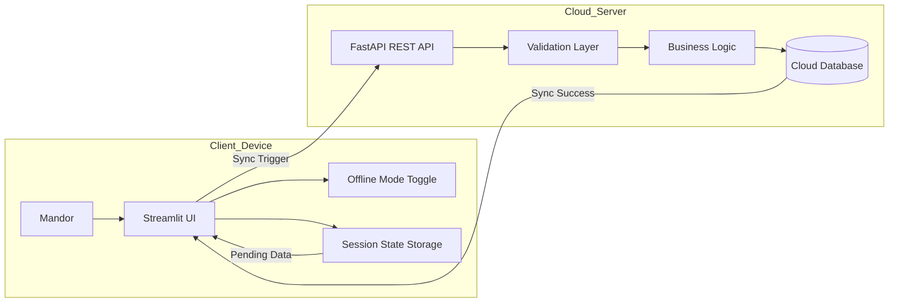

# Cloud App - E-Mandor

Aplikasi e-Mandor merupakan sistem informasi berbasis cloud computing dengan pendekatan Progressive Web App (PWA) yang dirancang untuk mendigitalisasi pencatatan hasil panen kelapa sawit di tingkat afdeling. Sistem ini ditujukan bagi mandor panen sebagai pengguna utama untuk menginput data absensi, jumlah janjang, dan brondolan secara langsung melalui perangkat seluler, serta bagi staf administrasi (krani) untuk memantau laporan produksi harian secara real-time. Dengan dukungan arsitektur cloud-native dan fitur sinkronisasi offline-to-cloud, aplikasi ini tetap dapat digunakan di area perkebunan yang memiliki keterbatasan jaringan internet.

Pengembangan e-Mandor bertujuan mengatasi berbagai kendala pencatatan manual berbasis kertas yang selama ini rentan terhadap kerusakan dokumen, kesalahan rekapitulasi, serta keterlambatan pelaporan. Melalui otomatisasi proses rekap dan perhitungan estimasi premi secara instan, sistem ini meningkatkan efisiensi operasional sekaligus memperkuat akurasi data produksi. Selain mempercepat alur informasi dari kebun ke manajemen, e-Mandor juga mendorong transparansi pengupahan sehingga dapat meminimalkan potensi kesalahan perhitungan dan sengketa antara pekerja dan perusahaan.

## Architechture Overview

