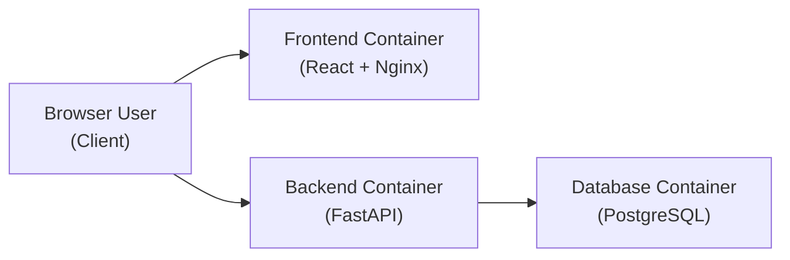
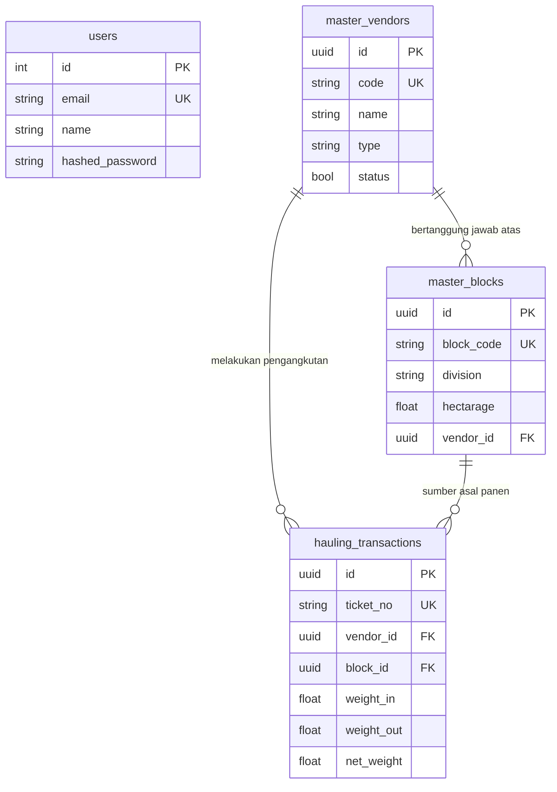

# PalmTrack Cloud — PalmChain

**PalmTrack Cloud** adalah sistem informasi cloud-native yang mendigitalisasi proses pencatatan dan monitoring pengangkutan Tandan Buah Segar (TBS) kelapa sawit dari kebun ke pabrik. Sistem ini memungkinkan admin atau krani untuk memantau transaksi pengangkutan (hauling), mengelola data vendor/kontraktor, mengatur data blok panen, serta melihat ringkasan produksi harian secara real-time melalui dashboard terintegrasi.

---


## Fitur Utama Sistem

Berikut adalah fitur inti yang telah diimplementasikan dalam versi saat ini:

- **Manajemen Akses Pengguna**
  - Registrasi dan otentikasi aman berbasis *JSON Web Token* (JWT).
  - Pembatasan akses ke *protected routes* bagi pengguna yang tidak terafiliasi.

- **Manajemen Vendor (Kontraktor)**
  - Pencatatan informasi vendor transportasi (Nama, Tipe: Inti/Swadaya/Transportir).
  - Status aktif/non-aktif untuk mengatur ketersediaan armada.

- **Manajemen Blok Panen (Afdeling)**
  - Pemetaan blok-blok perkebunan beserta luas area (hektar).
  - Asosiasi penanggung jawab pengangkutan pada masing-masing blok.

- **Actual Hauling (Transaksi Pengangkutan)**
  - Pencatatan nomor resi/tiket timbang.
  - Perhitungan otomatis tonase bersih (*Net Weight*) dari selisih timbangan kotor dan kosong.

- **Visualisasi Data (Dashboard)**
  - Ringkasan statistik performa harian dan akumulasi bulanan.
  - Grafik tren pengangkutan TBS yang mudah dipahami.

---

## Identitas Tim

| Nama | NIM | Peran |
|------|-----|-------|
| Adam Ibnu Ramadhan | 10231003 | Lead Backend |
| Adhyasta Firdaus | 10231005 | Lead CI/CD & Deployment |
| Adonia Azarya Tamalonggehe | 10231007 | Lead QA & Documentation |
| Alfian Fadillah Putra | 10231009 | Lead Frontend |
| Varrel Kaleb Ropard Pasaribu | 10231089 | Lead DevOps & Container |

---

## Tech Stack

| Layer | Teknologi | Versi | Fungsi |
|-------|-----------|-------|--------|
| **Frontend** | React + Vite + Recharts | 19 / 7 | Pembuatan SPA dashboard UI dan visualisasi data |
| **Backend** | Python + FastAPI | 3.12 / 0.115 | REST API server berkinerja tinggi |
| **Database** | PostgreSQL | 16-alpine | Penyimpanan data relasional |
| **ORM** | SQLAlchemy | 2.0.35 | Pemetaan objek relasional untuk database |
| **Validation** | Pydantic | 2.9.0 | Validasi skema request dan response API |
| **Auth** | JWT (python-jose) + bcrypt | — | Token-based authentication |
| **Container** | Docker + Docker Compose | — | Kontainerisasi layanan terintegrasi |
| **Web Server** | Nginx | alpine | Serving static files frontend |

---

## Arsitektur Sistem

Aplikasi berjalan dalam 3 container utama yang saling terhubung melalui Docker custom network (`cloudnet`).



---

## Struktur Proyek

```
cc-kelompok-a-awit/
├── backend/                  # REST API (FastAPI)
│   ├── main.py               # Entry point FastAPI & route definitions
│   ├── models.py             # SQLAlchemy models (Tabel DB)
│   ├── schemas.py            # Pydantic validation schemas
│   ├── crud.py               # Fungsi logika bisnis dan query DB
│   ├── auth.py               # Konfigurasi JWT dan hashing password
│   ├── database.py           # Koneksi PostgreSQL
│   └── Dockerfile            # Multi-stage build Python
├── frontend/                 # UI Client (React)
│   ├── src/                  # Komponen React, Pages, Routes, dan Context
│   ├── nginx.conf            # Konfigurasi reverse proxy Nginx
│   └── Dockerfile            # Multi-stage build Node -> Nginx
├── docs/                     # Laporan QA, testing, arsitektur, dan skema lengkap
├── scripts/                  # Shell scripts pendukung untuk Docker
├── docker-compose.yml        # Konfigurasi orkestrasi ke-3 container
└── Readme.md                 # Dokumentasi proyek
```

---

## Authentication Flow

Seluruh endpoint API dilindungi oleh otentikasi **JWT (JSON Web Token)**, kecuali endpoint registrasi, login, dan health check.

**Alur Autentikasi:**
1. **Register** — Klien mengirimkan data pendaftaran ke `POST /auth/register`.
2. **Login** — Klien mengirimkan kredensial (email & password) ke `POST /auth/login`. Jika valid, backend merespons dengan `access_token` (JWT).
3. **Penyimpanan** — Frontend menyimpan token di `localStorage` (`palmtrack_access_token`).
4. **Otorisasi** — Untuk setiap permintaan selanjutnya ke API, frontend akan menyertakan token di bagian header:
   ```http
   Authorization: Bearer <access_token>
   ```

Token yang diterbitkan memiliki batas waktu (expired) selama **60 menit**.

---

## API Endpoints Reference

Aplikasi ini memiliki 22 REST API endpoints yang dikelola oleh FastAPI.

### Public Endpoints (No Auth)
| Method | Endpoint | Deskripsi | Status Code |
|--------|----------|-----------|-------------|
| `GET` | `/health` | Health check ketersediaan API | 200 |
| `GET` | `/team` | Menampilkan informasi identitas tim | 200 |
| `POST` | `/auth/register` | Mendaftarkan pengguna (user) baru | 201 / 400 / 422 |
| `POST` | `/auth/login` | Login user untuk mendapatkan akses token | 200 / 401 |

### Protected Endpoints (Bearer Token Required)

**User Profile**
| Method | Endpoint | Deskripsi | Status Code |
|--------|----------|-----------|-------------|
| `GET` | `/auth/me` | Mengambil data profil user yang sedang aktif (login) | 200 / 401 |

**Master Data: Vendors (Kontraktor Transportir)**
| Method | Endpoint | Deskripsi | Status Code |
|--------|----------|-----------|-------------|
| `POST` | `/api/vendors` | Membuat data vendor pengangkut baru | 201 / 400 / 401 |
| `GET` | `/api/vendors` | Melihat daftar seluruh vendor (beserta filter & pagination) | 200 / 401 |
| `GET` | `/api/vendors/{id}` | Mengambil detail spesifik dari satu vendor berdasarkan UUID | 200 / 401 / 404 |
| `PUT` | `/api/vendors/{id}` | Mengubah informasi vendor | 200 / 401 / 404 |
| `DELETE`| `/api/vendors/{id}` | Menghapus data vendor | 204 / 401 / 404 |

**Master Data: Blocks (Area Panen / Afdeling)**
| Method | Endpoint | Deskripsi | Status Code |
|--------|----------|-----------|-------------|
| `POST` | `/api/blocks` | Membuat area blok panen baru | 201 / 400 / 401 |
| `GET` | `/api/blocks` | Melihat daftar seluruh area blok (beserta filter) | 200 / 401 |
| `GET` | `/api/blocks/{id}` | Mengambil detail spesifik area blok berdasarkan UUID | 200 / 401 / 404 |
| `PUT` | `/api/blocks/{id}` | Mengubah informasi blok panen | 200 / 401 / 404 |
| `DELETE`| `/api/blocks/{id}` | Menghapus data blok | 204 / 401 / 404 |

**Transactions: Hauling (Pengangkutan TBS)**
| Method | Endpoint | Deskripsi | Status Code |
|--------|----------|-----------|-------------|
| `POST` | `/api/hauling-transactions` | Merekam data transaksi pengangkutan (berat masuk/keluar) | 201 / 400 / 401 |
| `GET` | `/api/hauling-transactions` | Menampilkan seluruh transaksi (dengan filtering blok/vendor) | 200 / 401 |
| `GET` | `/api/hauling-transactions/{id}`| Detail spesifik sebuah transaksi | 200 / 401 / 404 |
| `PUT` | `/api/hauling-transactions/{id}`| Memperbarui catatan transaksi (contoh: status keluar gate) | 200 / 401 / 404 |
| `DELETE`| `/api/hauling-transactions/{id}`| Menghapus catatan transaksi | 204 / 401 / 404 |

**Dashboard Statistics**
| Method | Endpoint | Deskripsi | Status Code |
|--------|----------|-----------|-------------|
| `GET` | `/api/dashboard` | Menarik statistik ringkasan hari ini dan Month-to-Date (MTD) | 200 / 401 |

---

## Database Schema

### Relasi Entitas (ER Diagram)


### 1. Tabel `users`
Tabel untuk mengelola otentikasi.
| Kolom | Tipe | Constraint | Deskripsi |
|-------|------|-----------|-----------|
| `id` | INTEGER | PK, auto | Primary key |
| `email` | VARCHAR | UNIQUE | Email untuk login |
| `name` | VARCHAR | NOT NULL | Nama lengkap user |
| `hashed_password`| VARCHAR | NOT NULL | Password terenkripsi dengan bcrypt |

### 2. Tabel `master_vendors`
Tabel pengelola data kontraktor/supir pengangkut buah.
| Kolom | Tipe | Constraint | Deskripsi |
|-------|------|-----------|-----------|
| `id` | UUID | PK, auto | Primary key |
| `code` | VARCHAR(10) | UNIQUE | Kode unik (contoh: VND-001) |
| `name` | VARCHAR(100)| NOT NULL | Nama entitas atau individu |
| `type` | VARCHAR(50) | nullable | Tipe (Transportir/Inti/Swadaya) |
| `status` | BOOLEAN | DEFAULT true| Aktif/Tidak Aktif |

### 3. Tabel `master_blocks`
Tabel pengelola data area afdeling atau blok kebun.
| Kolom | Tipe | Constraint | Deskripsi |
|-------|------|-----------|-----------|
| `id` | UUID | PK, auto | Primary key |
| `block_code` | VARCHAR(10) | UNIQUE | Kode unik blok (contoh: BLK-01A) |
| `division` | VARCHAR(50) | nullable | Afdeling |
| `hectarage` | FLOAT | nullable | Luas area panen dalam Hektar |
| `vendor_id` | UUID | FK | Relasi ke vendor penanggung jawab |

### 4. Tabel `hauling_transactions`
Tabel rekapitulasi masuk dan keluarnya kendaraan pengangkut TBS kelapa sawit.
| Kolom | Tipe | Constraint | Deskripsi |
|-------|------|-----------|-----------|
| `id` | UUID | PK, auto | Primary key |
| `ticket_no` | VARCHAR(20) | UNIQUE | Nomor resi/tiket gerbang timbang |
| `vendor_id` | UUID | FK | Vendor pelaksana pengangkutan |
| `block_id` | UUID | FK | Asal blok panen TBS |
| `vehicle_plate`| VARCHAR(15) | NOT NULL | Nomor Polisi / Plat kendaraan |
| `weight_in` | FLOAT | NOT NULL | Berat kotor saat kendaraan terisi (Ton) |
| `weight_out` | FLOAT | NOT NULL | Berat kendaraan kosong (Ton) |
| `net_weight` | FLOAT | Calculated | Tonase bersih (`weight_in - weight_out`) |

*(Seluruh tabel secara otomatis merekam `created_at` dan `updated_at` timestamps).*

---

## Panduan Menjalankan Aplikasi (Menggunakan Docker)

Untuk menjalankan proyek ini, cara paling mudah dan direkomendasikan adalah menggunakan **Docker Compose**. Docker akan mengotomatiskan setup PostgreSQL, instalasi *dependencies* Backend, serta membangun aplikasi React di Frontend tanpa Anda perlu mengaturnya secara manual.

### Persyaratan Awal:
- [Docker Desktop](https://www.docker.com/products/docker-desktop/) telah terinstal dan sedang berjalan.
- `git` terinstal di komputer.

### Langkah-Langkah Instalasi:

1. **Kloning Repositori:**
   ```bash
   git clone https://github.com/aidilsaputrakirsan-classroom/cc-kelompok-a-awit.git
   cd cc-kelompok-a-awit
   ```

2. **Jalankan Orkestrasi Docker:**
   Gunakan perintah berikut di terminal untuk mengunduh, membangun ulang (build), dan menjalankan ketiga *container* di latar belakang:
   ```bash
   docker compose up --build -d
   ```

3. **Verifikasi Layanan (Pengecekan):**
   Pastikan tidak ada error dan ketiga service berjalan.
   ```bash
   docker compose ps
   ```
   *Anda akan melihat 3 status UP untuk service: `db` (PostgreSQL), `backend` (FastAPI), dan `frontend` (Nginx).*

4. **Akses Aplikasi Melalui Browser:**
   - **Frontend (Aplikasi Web Utama):** Buka [http://localhost:3000](http://localhost:3000)
   - **Backend API (Swagger Docs):** Buka [http://localhost:8000/docs](http://localhost:8000/docs)

**Cara Mematikan Layanan:**
```bash
# Untuk mematikan tanpa menghapus data
docker compose down

# Untuk mematikan dan mereset total database (menghapus volume)
docker compose down -v
```

---

## Progress Pengerjaan

| Tahap | Fitur | Status |
|-------|-------|--------|
| **Backend** | Skema Database (Vendor, Block, Hauling, User) | Selesai |
| **Backend** | Seluruh 22 CRUD API dan Dashboard endpoint | Selesai |
| **Backend** | Autentikasi keamanan JWT terintegrasi ke seluruh route | Selesai |
| **Frontend** | Konfigurasi Layout Dashboard dan state AuthContext | Selesai |
| **Frontend** | Halaman Visualisasi Dashboard (Grafik MTD & Daily Stats) | Selesai |
| **Frontend** | Halaman Manajemen Kontraktor (Full CRUD Tabel & Form) | Selesai |
| **Frontend** | Halaman Manajemen Blok Area (Full CRUD Tabel & Form) | Selesai |
| **Frontend** | Halaman Transaksi *Actual Hauling* (Input berat TBS) | Dalam Pengerjaan |
| **DevOps** | Orkestrasi Multi-Container (Frontend, Backend, DB, Networks) | Selesai |

---

## Dokumentasi QA & Teknis Tambahan

Sebagai bagian dari jaminan mutu proyek (Quality Assurance), seluruh aspek teknis dan fungsional telah melalui proses uji coba dan didokumentasikan di folder `docs/`. Silakan klik tautan berikut untuk membaca laporannya:

- [Panduan Setup (Manual & Docker)](docs/setup-guide.md)
- [Arsitektur Docker Detail (Multi-Container)](docs/docker-architecture.md)
- [Skema Database & Relasi Detil](docs/database-schema.md)
- [Hasil Pengujian UI/UX Aplikasi (Lengkap dengan Screenshot)](docs/ui-test-results.md)
- [Hasil Pengujian Seluruh Endpoint API](docs/api-test-results.md)
- [Hasil Pengujian Keamanan Autentikasi](docs/auth-test-results.md)
- [Panduan Skenario Demo Ujian Tengah Semester (UTS)](docs/uts-demo-script.md)

---
*Dokumentasi disusun dan difinalisasi secara profesional oleh **Adonia Azarya Tamalonggehe** (Lead QA & Documentation).*
