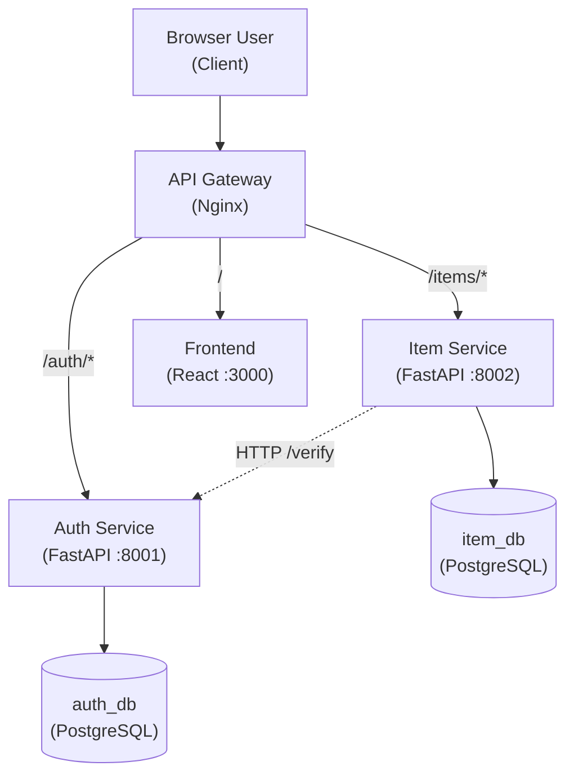

# PalmTrack Cloud — PalmChain
[](https://github.com/aidilsaputrakirsan-classroom/cc-kelompok-a-awit/actions/workflows/ci.yml)

**PalmTrack Cloud** adalah sistem informasi cloud-native yang mendigitalisasi proses pencatatan dan monitoring pengangkutan Tandan Buah Segar (TBS) kelapa sawit dari kebun ke pabrik. Sistem ini memungkinkan admin atau krani untuk memantau transaksi pengangkutan (hauling), mengelola data vendor/kontraktor, mengatur data blok panen, serta melihat ringkasan produksi harian secara real-time melalui dashboard terintegrasi.

---

## Fitur Utama Sistem

Berikut adalah fitur inti yang telah diimplementasikan dalam versi saat ini:

- **Manajemen Akses Pengguna**
  - Registrasi dan otentikasi aman berbasis *JSON Web Token* (JWT).
  - Pembatasan akses ke *protected routes* bagi pengguna yang tidak terafiliasi.

- **Manajemen Vendor (Kontraktor)**
  - Pencatatan informasi vendor transportasi (Nama, Tipe: Inti/Swadaya/Transportir).
  - Status aktif/non-aktif untuk mengatur ketersediaan armada.

- **Manajemen Blok Panen (Afdeling)**
  - Pemetaan blok-blok perkebunan beserta luas area (hektar).
  - Asosiasi penanggung jawab pengangkutan pada masing-masing blok.

- **Actual Hauling (Transaksi Pengangkutan)**
  - Pencatatan nomor resi/tiket timbang.
  - Perhitungan otomatis tonase bersih (*Net Weight*) dari selisih timbangan kotor dan kosong.

- **Visualisasi Data (Dashboard)**
  - Ringkasan statistik performa harian dan akumulasi bulanan.
  - Grafik tren pengangkutan TBS yang mudah dipahami.

---

## Identitas Tim

| Nama | NIM | Peran |
|------|-----|-------|
| Adam Ibnu Ramadhan | 10231003 | Lead Backend |
| Adhyasta Firdaus | 10231005 | Lead CI/CD & Deployment |
| Adonia Azarya Tamalonggehe | 10231007 | Lead QA & Documentation |
| Alfian Fadillah Putra | 10231009 | Lead Frontend |
| Varrel Kaleb Ropard Pasaribu | 10231089 | Lead DevOps & Container |

---

## Tech Stack

| Layer | Teknologi | Versi | Fungsi |
|-------|-----------|-------|--------|
| **Frontend** | React + Vite + Recharts | 19 / 7 | Pembuatan SPA dashboard UI dan visualisasi data |
| **Backend** | Python + FastAPI | 3.12 / 0.115 | REST API server berkinerja tinggi (Microservices) |
| **Database** | PostgreSQL | 16-alpine | Penyimpanan data relasional |
| **ORM** | SQLAlchemy | 2.0.35 | Pemetaan objek relasional untuk database |
| **Validation** | Pydantic | 2.9.0 | Validasi skema request dan response API |
| **Auth** | JWT (python-jose) + bcrypt | — | Token-based authentication |
| **Container** | Docker + Docker Compose | — | Kontainerisasi layanan terintegrasi |
| **Gateway** | Nginx | alpine | Reverse proxy, API Gateway, dan melayani frontend |

---

## Arsitektur Sistem (Microservices)

Sistem ini telah berevolusi dari monolitik menjadi arsitektur microservices. Aplikasi berjalan dalam 6 container utama yang saling terhubung melalui Docker custom network (`cloudnet`).



---

## Struktur Proyek

```
cc-kelompok-a-awit/
├── services/                 # Backend Microservices
│   ├── auth-service/         # Menangani otentikasi (login/register)
│   ├── item-service/         # Menangani entitas (vendor, blok, transaksi)
│   ├── gateway/              # Nginx konfigurasi untuk API Gateway
│   └── shared/               # Modul logging & metrik bersama
├── frontend/                 # UI Client (React)
│   ├── src/                  # Komponen React, Pages, Routes, dan Context
│   └── Dockerfile            # Multi-stage build Node -> Nginx
├── docs/                     # Laporan QA, testing, arsitektur, dan skema lengkap
├── scripts/                  # Shell scripts pendukung untuk Docker & Log
├── docker-compose.yml        # Konfigurasi orkestrasi 6 container
└── README.md                 # Dokumentasi proyek utama
```

---

## Authentication Flow

Seluruh endpoint API dilindungi oleh otentikasi **JWT (JSON Web Token)**, kecuali endpoint registrasi, login, dan health check.

**Alur Autentikasi:**
1. **Register** — Klien mengirimkan data pendaftaran ke `POST /auth/register`.
2. **Login** — Klien mengirimkan kredensial (email & password) ke `POST /auth/login`. Jika valid, backend merespons dengan `access_token` (JWT).
3. **Penyimpanan** — Frontend menyimpan token di `localStorage` (`palmtrack_access_token`).
4. **Otorisasi** — Untuk setiap permintaan selanjutnya ke API, frontend menyertakan token di bagian header:
   ```http
   Authorization: Bearer <access_token>
   ```

Token yang diterbitkan memiliki batas waktu (expired) selama **30 menit**.

---

## Progress Pengerjaan

| Tahap | Fitur | Status |
|-------|-------|--------|
| **Backend** | Skema Database (Vendor, Block, Hauling, User) | ✅ Selesai |
| **Backend** | Seluruh 22 CRUD API dan Dashboard endpoint | ✅ Selesai |
| **Backend** | Autentikasi keamanan JWT terintegrasi ke seluruh route | ✅ Selesai |
| **Frontend** | Konfigurasi Layout Dashboard dan state AuthContext | ✅ Selesai |
| **Frontend** | Halaman Visualisasi Dashboard (Grafik MTD & Daily Stats) | ✅ Selesai |
| **Frontend** | Halaman Manajemen Kontraktor (Full CRUD Tabel & Form) | ✅ Selesai |
| **Frontend** | Halaman Manajemen Blok Area (Full CRUD Tabel & Form) | ✅ Selesai |
| **Frontend** | Halaman Transaksi *Actual Hauling* (Input berat TBS) | ✅ Selesai |
| **DevOps** | Orkestrasi Multi-Container (Frontend, Backend, DB, Networks) | ✅ Selesai |
| **CI/CD (Week 9-11)** | Git Workflow, Branch Protection, & CODEOWNERS | ✅ Selesai |
| **CI/CD (Week 9-11)** | Automated Testing Pipeline via GitHub Actions | ✅ Selesai |
| **Release (Week 11)** | Milestone 2 (v2.0) & Production Deployment | ✅ Selesai |
| **Microservices (W12-14)** | Migrasi Monolith ke Auth & Item Service terpisah | ✅ Selesai |
| **Microservices (W12-14)** | Integrasi API Gateway (Nginx) & Circuit Breaker | ✅ Selesai |
| **Observability (W14)** | JSON Logging, Correlation ID, & Prometheus Metrics | ✅ Selesai |
| **Security (W15)** | Rate Limiting, Input Validation, & UAS Prep | ✅ Selesai |

---

## Panduan Menjalankan Aplikasi (Menggunakan Docker)

Cara paling mudah dan direkomendasikan adalah menggunakan **Docker Compose**. Docker akan mengotomatiskan setup PostgreSQL ganda, instalasi *dependencies* Backend, serta membangun aplikasi React di Frontend tanpa Anda perlu mengaturnya secara manual.

### Langkah-Langkah Instalasi:

1. **Kloning Repositori:**
   ```bash
   git clone https://github.com/aidilsaputrakirsan-classroom/cc-kelompok-a-awit.git
   cd cc-kelompok-a-awit
   ```

2. **Jalankan Orkestrasi Docker:**
   ```bash
   docker compose up --build -d
   ```

3. **Verifikasi Layanan (Pengecekan):**
   Pastikan tidak ada error dan keenam container berjalan.
   ```bash
   docker compose ps
   ```

4. **Akses Aplikasi Melalui Browser:**
   - **Frontend (Aplikasi Web Utama):** Buka [http://localhost](http://localhost) (via Gateway)
   - **Auth API Swagger:** Buka [http://localhost/auth/docs](http://localhost/auth/docs)
   - **Item API Swagger:** Buka [http://localhost/items/docs](http://localhost/items/docs)
   - **Status Dashboard:** Buka [http://localhost/status](http://localhost/status)

---

## Dokumentasi QA & Teknis Tambahan

Sebagai bagian dari jaminan mutu proyek (Quality Assurance), seluruh aspek teknis dan fungsional telah melalui proses uji coba dan didokumentasikan di folder `docs/`. Silakan klik tautan berikut untuk membaca laporannya:

- [Panduan Setup (Manual & Docker)](docs/setup-guide.md)
- [Arsitektur Docker Detail (Multi-Container)](docs/docker-architecture.md)
- [Skema Database & Relasi Detil](docs/database-schema.md)
- [Hasil Pengujian UI/UX Aplikasi (Lengkap dengan Screenshot)](docs/ui-test-results.md)
- [Hasil Pengujian Seluruh Endpoint API](docs/api-test-results.md)
- [Hasil Pengujian Keamanan Autentikasi](docs/auth-test-results.md)
- [Panduan Skenario Demo Ujian Tengah Semester (UTS)](docs/uts-demo-script.md)
- [Retrospektif Milestone 1 (Week 1-8)](docs/retrospective-m1.md)
- [Panduan Git Workflow & Kolaborasi Tim](docs/git-workflow.md)
- [Panduan Testing & CI/CD](docs/testing-guide.md)
- [Release Notes Milestone 2 (v2.0)](docs/release-notes-m2.md)
- [Release Notes Milestone 3 (v3.0 - UAS)](docs/release-notes-m3.md)
- [API Contract Microservices](docs/api-contract-microservices.md)
- [Panduan Operasional & Troubleshooting](docs/operations-guide.md)
- [Checklist Kesiapan Final (UAS QA Lulus)](docs/final-checklist.md)

---
*Dokumentasi disusun dan difinalisasi secara profesional oleh **Adonia Azarya Tamalonggehe** (Lead QA & Documentation).*
