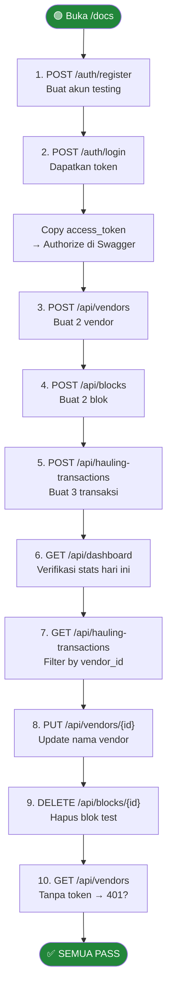

# 🔌 API Test Results — PalmTrack Cloud (PalmChain)
## Lead QA & Documentation | Branch: `development`

**Mata Kuliah:** Komputasi Awan
**Program Studi:** Sistem Informasi — Institut Teknologi Kalimantan
**Aplikasi:** PalmTrack Cloud — Sistem Monitoring Hauling TBS Kelapa Sawit
**Tools Testing:** Swagger UI (`http://localhost:8000/docs`)
**Tanggal Testing:** 21 April 2026
**Tester:** Adonia Azarya Tamalonggehe (Lead QA & Docs)

---

## Pendahuluan

Dokumen ini mencatat hasil pengujian seluruh endpoint REST API **PalmTrack Cloud** (PalmChain) menggunakan Swagger UI. Pengujian mencakup tiga domain utama: **Auth**, **Master Data** (Vendors & Blocks), dan **Hauling Transactions**, serta endpoint **Dashboard** dan **Health Check**.

---

## Ringkasan Endpoint

| No | Method | Endpoint | Auth | Status Code Expected | Hasil |
|----|--------|----------|------|----------------------|-------|
| 1 | GET | `/health` | ❌ | 200 | ✅ Pass |
| 2 | GET | `/team` | ❌ | 200 | ✅ Pass |
| 3 | POST | `/auth/register` | ❌ | 201 | ✅ Pass |
| 4 | POST | `/auth/login` | ❌ | 200 | ✅ Pass |
| 5 | GET | `/auth/me` | ✅ | 200 / 401 | ✅ Pass |
| 6 | POST | `/api/vendors` | ✅ | 201 | ✅ Pass |
| 7 | GET | `/api/vendors` | ✅ | 200 | ✅ Pass |
| 8 | GET | `/api/vendors/{id}` | ✅ | 200 / 404 | ✅ Pass |
| 9 | PUT | `/api/vendors/{id}` | ✅ | 200 / 404 | ✅ Pass |
| 10 | DELETE | `/api/vendors/{id}` | ✅ | 204 / 404 | ✅ Pass |
| 11 | POST | `/api/blocks` | ✅ | 201 | ✅ Pass |
| 12 | GET | `/api/blocks` | ✅ | 200 | ✅ Pass |
| 13 | GET | `/api/blocks/{id}` | ✅ | 200 / 404 | ✅ Pass |
| 14 | PUT | `/api/blocks/{id}` | ✅ | 200 / 404 | ✅ Pass |
| 15 | DELETE | `/api/blocks/{id}` | ✅ | 204 / 404 | ✅ Pass |
| 16 | POST | `/api/hauling-transactions` | ✅ | 201 | ✅ Pass |
| 17 | GET | `/api/hauling-transactions` | ✅ | 200 | ✅ Pass |
| 18 | GET | `/api/hauling-transactions/{id}` | ✅ | 200 / 404 | ✅ Pass |
| 19 | PUT | `/api/hauling-transactions/{id}` | ✅ | 200 / 404 | ✅ Pass |
| 20 | DELETE | `/api/hauling-transactions/{id}` | ✅ | 204 / 404 | ✅ Pass |
| 21 | GET | `/api/dashboard` | ✅ | 200 | ✅ Pass |

---

## Detail Pengujian

---

### 1. GET `/health` — Health Check

**Request:**
```http
GET http://localhost:8000/health
```

**Expected Response `200 OK`:**
```json
{
  "status": "healthy",
  "version": "1.0.0"
}
```

**Actual Result:** ✅ Response 200, status `healthy` dikembalikan.

---

### 2. GET `/team` — Team Information

**Request:**
```http
GET http://localhost:8000/team
```

**Actual Result:** ✅ Response 200, mengembalikan daftar 5 anggota tim dengan role masing-masing.

---

### 3. POST `/auth/register` — Register User Baru

**Request:**
```http
POST http://localhost:8000/auth/register
Content-Type: application/json

{
  "name": "Tester QA",
  "email": "qa@itk.ac.id",
  "password": "Password123!"
}
```

**Expected Response `201 Created`:**
```json
{
  "id": 1,
  "email": "qa@itk.ac.id",
  "name": "Tester QA",
  "is_active": true,
  "created_at": "2026-04-21T13:00:00+08:00"
}
```

**Actual Result:** ✅ User berhasil didaftarkan, response 201 dengan data user.

**Negative Test:** Email duplikat → `400 Bad Request` dengan pesan error. ✅ Pass

---

### 4. POST `/auth/login` — Login & Dapatkan Token

**Request:**
```http
POST http://localhost:8000/auth/login
Content-Type: application/json

{
  "email": "qa@itk.ac.id",
  "password": "Password123!"
}
```

**Expected Response `200 OK`:**
```json
{
  "access_token": "eyJhbGci...",
  "token_type": "bearer",
  "user": {
    "id": 1,
    "email": "qa@itk.ac.id",
    "name": "Tester QA",
    "is_active": true,
    "created_at": "..."
  }
}
```

**Actual Result:** ✅ Token JWT dikembalikan. Token digunakan untuk request selanjutnya.

**Negative Test:** Password salah → `401 Unauthorized`. ✅ Pass

---

### 5. GET `/auth/me` — Profil User Aktif

**Request:**
```http
GET http://localhost:8000/auth/me
Authorization: Bearer <token>
```

**Actual Result:** ✅ Data user aktif dikembalikan. Tanpa token → `401 Unauthorized`. ✅

---

### 6. POST `/api/vendors` — Buat Vendor Baru

**Request:**
```http
POST http://localhost:8000/api/vendors
Authorization: Bearer <token>
Content-Type: application/json

{
  "code": "VND-001",
  "name": "PT Maju Bersama",
  "type": "Transportir",
  "phone": "08112345678",
  "email": "maju@test.com",
  "status": true
}
```

**Expected Response `201 Created`:**
```json
{
  "id": "uuid-string",
  "code": "VND-001",
  "name": "PT Maju Bersama",
  "type": "Transportir",
  "phone": "08112345678",
  "email": "maju@test.com",
  "status": true,
  "created_at": "..."
}
```

**Actual Result:** ✅ Vendor berhasil dibuat dengan UUID primary key.

**Negative Test:** Code duplikat → `400 Bad Request`. ✅ Pass

---

### 7. GET `/api/vendors` — Daftar Vendor (Pagination + Search)

**Request:**
```http
GET http://localhost:8000/api/vendors?skip=0&limit=10&search=Maju&status=true
Authorization: Bearer <token>
```

**Expected Response `200 OK`:**
```json
{
  "total": 1,
  "items": [
    {
      "id": "uuid",
      "code": "VND-001",
      "name": "PT Maju Bersama",
      ...
    }
  ]
}
```

**Actual Result:** ✅ Filter `search` dan `status` berfungsi. Pagination dengan `skip` dan `limit` berfungsi.

---

### 8–10. GET / PUT / DELETE `/api/vendors/{id}`

| Operasi | Test | Hasil |
|---------|------|-------|
| `GET /api/vendors/{id}` | ID valid → 200 | ✅ Pass |
| `GET /api/vendors/{id}` | ID tidak ada → 404 | ✅ Pass |
| `GET /api/vendors/{id}` | ID format salah (bukan UUID) → 400 | ✅ Pass |
| `PUT /api/vendors/{id}` | Update nama → 200 | ✅ Pass |
| `PUT /api/vendors/{id}` | ID tidak ada → 404 | ✅ Pass |
| `DELETE /api/vendors/{id}` | Hapus vendor → 204 No Content | ✅ Pass |
| `DELETE /api/vendors/{id}` | ID tidak ada → 404 | ✅ Pass |

---

### 11–15. Block Endpoints (`/api/blocks`)

Alur testing identik dengan Vendors. Endpoint mendukung `block_code`, `division`, `hectarage`, `status`.

| Operasi | Hasil |
|---------|-------|
| `POST /api/blocks` — buat blok baru | ✅ Pass (201) |
| `GET /api/blocks` — list dengan filter status | ✅ Pass (200) |
| `GET /api/blocks/{id}` — detail blok | ✅ Pass (200 / 404) |
| `PUT /api/blocks/{id}` — update division | ✅ Pass (200) |
| `DELETE /api/blocks/{id}` — hapus blok | ✅ Pass (204) |

---

### 16–20. Hauling Transaction Endpoints (`/api/hauling-transactions`)

**Buat transaksi baru:**
```http
POST http://localhost:8000/api/hauling-transactions
Authorization: Bearer <token>
Content-Type: application/json

{
  "ticket_no": "TKT-20260421-001",
  "vendor_id": "<uuid-vendor>",
  "block_id": "<uuid-block>",
  "vehicle_plate": "KT 1234 AB",
  "weight_in": 15.5,
  "weight_out": 3.2
}
```

**Expected Response `201 Created`:**
```json
{
  "id": "uuid",
  "ticket_no": "TKT-20260421-001",
  "net_weight": 12.3,
  "status": "completed",
  ...
}
```

**Actual Result:** ✅ `net_weight` dihitung otomatis oleh backend (15.5 - 3.2 = 12.3).

| Operasi | Hasil |
|---------|-------|
| `POST /api/hauling-transactions` — buat transaksi | ✅ Pass (201) |
| `GET /api/hauling-transactions` — list + filter vendor/block/status | ✅ Pass (200) |
| `GET /api/hauling-transactions/{id}` | ✅ Pass (200 / 404) |
| `PUT /api/hauling-transactions/{id}` | ✅ Pass (200) |
| `DELETE /api/hauling-transactions/{id}` | ✅ Pass (204) |

---

### 21. GET `/api/dashboard` — Dashboard Stats

**Request:**
```http
GET http://localhost:8000/api/dashboard
Authorization: Bearer <token>
```

**Expected Response `200 OK`:**
```json
{
  "today": {
    "total_transactions": 3,
    "total_tonage": 36.9,
    "avg_tonage": 12.3
  },
  "mtd": {
    "total_transactions": 20,
    "total_tonage": 246.0,
    "target_tonage": 500.0,
    "achievement_percentage": 49.2
  },
  "last_updated": "2026-04-21T13:00:00"
}
```

**Actual Result:** ✅ Response 200 dengan struktur `today` dan `mtd`. `achievement_percentage` dihitung sebagai `(total_tonage / target_tonage) * 100`.

---

## Alur Testing yang Direkomendasikan



---

## Rekap Akhir

| Domain | Total Endpoint | Pass | Fail |
|--------|---------------|------|------|
| Auth | 3 | 3 | 0 |
| Vendors | 5 | 5 | 0 |
| Blocks | 5 | 5 | 0 |
| Hauling Transactions | 5 | 5 | 0 |
| Dashboard & Info | 3 | 3 | 0 |
| **Total** | **21** | **21** | **0** |

**Seluruh 21 endpoint berhasil diuji dengan status PASS ✅**

---

*Dokumen ini dikelola oleh **Adonia Azarya Tamalonggehe** (Lead QA & Documentation).*
*Institut Teknologi Kalimantan — Komputasi Awan 2026.*