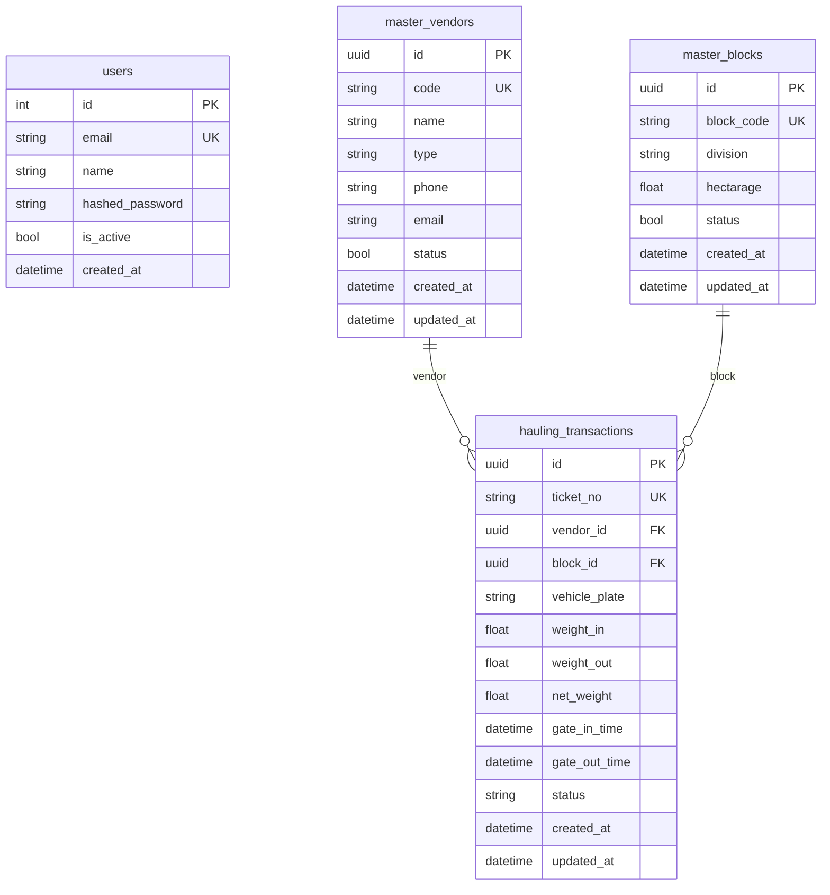

# 🗄️ Database Schema — PalmChain

Skema database **PalmTrack Cloud** terdiri dari 4 tabel yang merepresentasikan entitas utama dalam sistem monitoring rantai pasok TBS kelapa sawit.

---

## Tabel `users`

Menyimpan data akun pengguna sistem.

| Kolom | Tipe Data | Properti |
|-------|-----------|----------|
| `id` | INTEGER | Primary key, auto-increment |
| `email` | VARCHAR(255) | Unique, Not null, Indexed |
| `name` | VARCHAR(100) | Not null |
| `hashed_password` | VARCHAR(255) | Not null (bcrypt hash) |
| `is_active` | BOOLEAN | Default: `true` |
| `created_at` | DATETIME(timezone) | Server default NOW() |

---

## Tabel `master_vendors`

Menyimpan data master kontraktor/vendor transportir.

| Kolom | Tipe Data | Properti |
|-------|-----------|----------|
| `id` | UUID | Primary key, default uuid4 |
| `code` | VARCHAR(10) | Unique, Not null, Indexed |
| `name` | VARCHAR(100) | Not null |
| `type` | VARCHAR(50) | Nullable (Transportir / Petani Swadaya / Inti) |
| `phone` | VARCHAR(15) | Nullable |
| `email` | VARCHAR(100) | Nullable |
| `status` | BOOLEAN | Default: `true` (aktif) |
| `created_at` | DATETIME(timezone) | Server default NOW() |
| `updated_at` | DATETIME(timezone) | On update CURRENT_TIMESTAMP |

---

## Tabel `master_blocks`

Menyimpan data master blok/afdeling area panen.

| Kolom | Tipe Data | Properti |
|-------|-----------|----------|
| `id` | UUID | Primary key, default uuid4 |
| `block_code` | VARCHAR(10) | Unique, Not null, Indexed |
| `division` | VARCHAR(50) | Nullable (nama afdeling) |
| `hectarage` | FLOAT | Nullable (luas area dalam hektar) |
| `status` | BOOLEAN | Default: `true` (aktif) |
| `created_at` | DATETIME(timezone) | Server default NOW() |
| `updated_at` | DATETIME(timezone) | On update CURRENT_TIMESTAMP |

---

## Tabel `hauling_transactions`

Menyimpan data transaksi pengangkutan TBS dari kebun ke pabrik.

| Kolom | Tipe Data | Properti |
|-------|-----------|----------|
| `id` | UUID | Primary key, default uuid4 |
| `ticket_no` | VARCHAR(20) | Unique, Not null, Indexed |
| `vendor_id` | UUID | Foreign key → `master_vendors.id`, Nullable |
| `block_id` | UUID | Foreign key → `master_blocks.id`, Nullable |
| `vehicle_plate` | VARCHAR(15) | Not null |
| `weight_in` | FLOAT | Not null (berat kotor dalam ton) |
| `weight_out` | FLOAT | Not null (berat kosong dalam ton) |
| `net_weight` | FLOAT | Nullable (tonase TBS = weight_in − weight_out) |
| `gate_in_time` | DATETIME(timezone) | Server default NOW(), Indexed |
| `gate_out_time` | DATETIME(timezone) | Nullable |
| `status` | VARCHAR(20) | Default: `"completed"` (completed / pending / cancelled) |
| `created_at` | DATETIME(timezone) | Server default NOW() |
| `updated_at` | DATETIME(timezone) | On update CURRENT_TIMESTAMP |

---

## Relasi Antar Tabel

### Catatan Desain

- **UUID primary key** digunakan untuk semua entitas utama (vendor, block, hauling) agar aman untuk distributed system di masa depan.
- **`net_weight`** dihitung dari `weight_in - weight_out` dan disimpan untuk efisiensi query tanpa hitung ulang.
- **`status` di `hauling_transactions`** memiliki tiga nilai: `completed`, `pending`, `cancelled`.
- **`status` di `master_vendors` & `master_blocks`** bertipe BOOLEAN: `true` = aktif, `false` = nonaktif (soft delete).
- Tabel `users` menggunakan INTEGER PK (auto-increment) karena volume user jauh lebih kecil.
