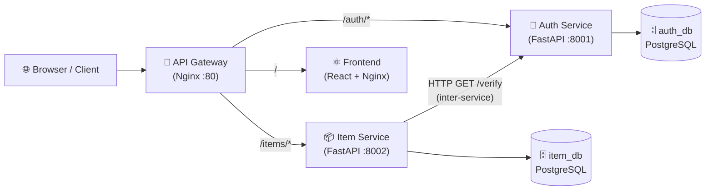
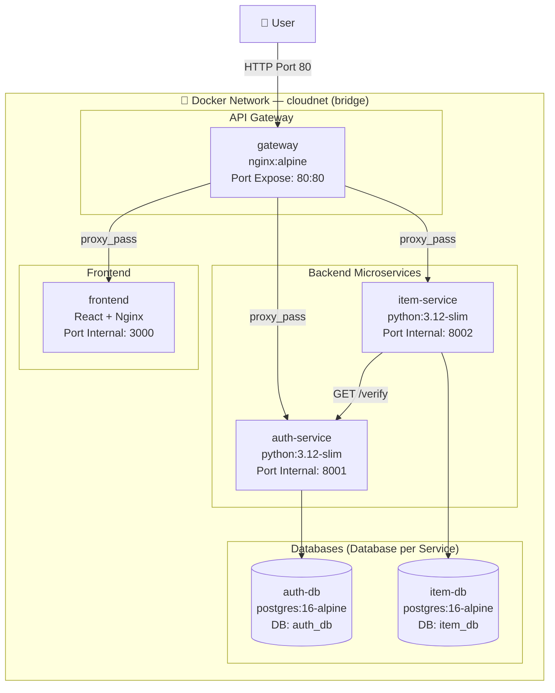
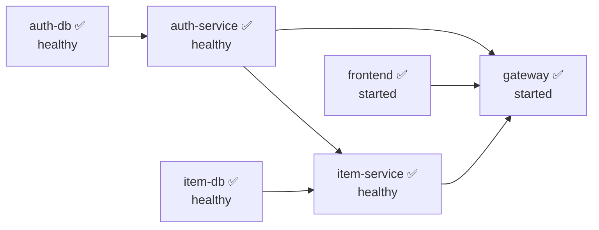
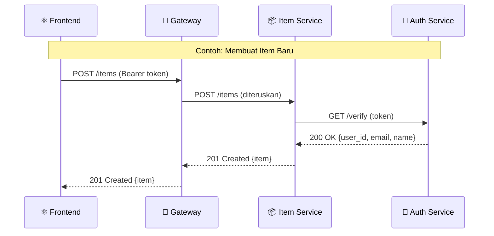

# Dokumentasi Arsitektur Microservices — PalmTrack Cloud (PalmChain)

> **Tanggal Dokumen:** 09 Juni 2026
> **Penulis:** Adonia Azarya Tamalonggehe (Lead QA & Documentation)
> **Versi Arsitektur:** 2.0 (Fase Microservices — Modul 12)
> **Mata Kuliah:** Komputasi Awan — Institut Teknologi Kalimantan

---

## 1. Diagram Arsitektur

### 1.1 Gambaran Umum (High-Level)



### 1.2 Container & Jaringan Docker



### 1.3 Urutan Startup Container



### 1.4 Alur Autentikasi (Sequence Diagram)



---

## 2. Daftar Services + Ports

| Container | Image | Port Expose | Port Internal | Database | Fungsi |
|-----------|-------|-------------|--------------|----------|--------|
| `gateway` | `nginx:alpine` | **80:80** | — | — | Pintu masuk tunggal, reverse proxy ke semua service |
| `auth-service` | `python:3.12-slim` | — | **8001** | `auth_db` | Register, login, verifikasi JWT token |
| `item-service` | `python:3.12-slim` | — | **8002** | `item_db` | CRUD item, verifikasi token via auth-service |
| `auth-db` | `postgres:16-alpine` | — | 5432 | — | Database eksklusif auth-service |
| `item-db` | `postgres:16-alpine` | — | 5432 | — | Database eksklusif item-service |
| `frontend` | React + Nginx | — | **3000** | — | Aplikasi React yang di-serve via Nginx |

**Gateway Routing Rules:**

| Path Prefix | Diteruskan ke | Contoh |
|-------------|--------------|--------|
| `/auth/` | `auth-service:8001` | `/auth/login` → `http://auth-service:8001/login` |
| `/items` | `item-service:8002` | `/items` → `http://item-service:8002/items` |
| `/health` | Gateway langsung | Mengembalikan `{"status":"healthy"}` |
| `/` (semua lain) | `frontend:3000` | `/dashboard` → React app |

---

## 3. API Contract Setiap Service

### 🔐 Auth Service (`/auth/*`)

#### `GET /auth/health`
```
Response 200:
{ "status": "healthy", "service": "auth-service", "version": "2.0.0" }
```

#### `POST /auth/register`
```
Request Body:
{ "email": "string", "password": "string", "name": "string" }

Response 201:
{ "id": 1, "email": "string", "name": "string", "created_at": "datetime" }

Response 400: { "detail": "Email already registered" }
```

#### `POST /auth/login`
```
Request Body:
{ "email": "string", "password": "string" }

Response 200:
{ "access_token": "eyJ...", "token_type": "bearer" }

Response 401: { "detail": "Invalid email or password" }
```

#### `GET /auth/verify` ⚠️ *(endpoint internal — dipanggil Item Service)*
```
Request Header:
Authorization: Bearer <JWT_TOKEN>

Response 200:
{ "user_id": 1, "email": "string", "name": "string" }

Response 401: { "detail": "Token expired" | "Invalid token" }
```

---

### 📦 Item Service (`/items/*`)

> Semua endpoint di bawah memerlukan header: `Authorization: Bearer <JWT_TOKEN>`

#### `GET /items/health`
```
Response 200:
{ "status": "healthy", "service": "item-service", "version": "2.0.0" }
```

#### `POST /items`
```
Request Body:
{ "name": "string", "description": "string?", "price": float, "quantity": int }

Response 201:
{ "id": 1, "name": "string", "description": "string", "price": float,
  "quantity": int, "owner_id": int, "created_at": "datetime" }
```

#### `GET /items?search=&skip=0&limit=20`
```
Query Params: search (opsional), skip (default 0), limit (default 20, max 100)

Response 200:
{ "total": int, "items": [ {item object}, ... ] }
```

#### `GET /items/{item_id}`
```
Response 200: { item object }
Response 404: { "detail": "Item not found" }
```

#### `PUT /items/{item_id}`
```
Request Body (semua field opsional):
{ "name"?, "description"?, "price"?, "quantity"? }

Response 200: { item object (updated) }
Response 404: { "detail": "Item not found" }
```

#### `DELETE /items/{item_id}`
```
Response 204: (no body)
Response 404: { "detail": "Item not found" }
```

**Error codes autentikasi (berlaku semua endpoint Item Service):**
```
Response 401: { "detail": "Invalid or expired token" }     → token bermasalah
Response 503: { "detail": "Auth service unavailable" }     → auth-service mati
Response 504: { "detail": "Auth Service timeout" }         → auth-service lambat (>5s)
```

---

## 4. Cara Menjalankan Lokal

### Prasyarat
- Docker Desktop terinstall dan berjalan
- Git repository sudah di-clone

### Langkah-langkah

```bash
# 1. Pastikan berada di root project
cd cc-kelompok-a-awit

# 2. Build dan jalankan semua 6 container
docker compose up --build -d

# 3. Cek status semua container (tunggu sampai semua "healthy")
docker compose ps

# 4. Akses aplikasi
#    Frontend         : http://localhost
#    Auth API Docs    : http://localhost/auth/docs
#    Health Check     : http://localhost/health
```

### Memastikan Semua Container Healthy

```bash
# Lihat status container secara detail
docker compose ps

# Output yang diharapkan (semua harus "running (healthy)"):
# NAME           STATUS
# auth-db        running (healthy)
# item-db        running (healthy)
# auth-service   running (healthy)
# item-service   running (healthy)
# frontend       running
# gateway        running
```

### Perintah Berguna

```bash
# Lihat log semua service secara real-time
docker compose logs -f

# Stop semua container (data tetap tersimpan)
docker compose down

# Reset total — hapus semua container DAN data volume
docker compose down -v && docker builder prune -f
```

---

## 5. Cara Debug Per Service

### 🔐 Debug Auth Service

```bash
# Lihat log auth-service secara real-time
docker compose logs -f auth-service

# Masuk ke dalam container auth-service (bash shell)
docker compose exec auth-service bash

# Test endpoint health secara langsung (dari luar container)
curl http://localhost/auth/health

# Test register user baru
curl -X POST http://localhost/auth/register \
  -H "Content-Type: application/json" \
  -d '{"email":"test@test.com","password":"test123","name":"Test User"}'

# Test login
curl -X POST http://localhost/auth/login \
  -H "Content-Type: application/json" \
  -d '{"email":"test@test.com","password":"test123"}'

# Akses Swagger UI (interactive docs)
# → http://localhost/auth/docs
```

### 📦 Debug Item Service

```bash
# Lihat log item-service secara real-time
docker compose logs -f item-service

# Masuk ke dalam container item-service
docker compose exec item-service bash

# Test endpoint dengan token (ganti <TOKEN> dengan hasil login)
curl http://localhost/items \
  -H "Authorization: Bearer <TOKEN>"

# Test create item
curl -X POST http://localhost/items \
  -H "Authorization: Bearer <TOKEN>" \
  -H "Content-Type: application/json" \
  -d '{"name":"Test Item","price":10000,"quantity":5}'
```

### 🗄️ Debug Database

```bash
# Masuk ke auth-db
docker compose exec auth-db psql -U postgres -d auth_db

# Masuk ke item-db
docker compose exec item-db psql -U postgres -d item_db

# Contoh query di dalam psql:
# \dt                    → lihat semua tabel
# SELECT * FROM users;   → lihat semua user (di auth-db)
# SELECT * FROM items;   → lihat semua item (di item-db)
# \q                     → keluar dari psql
```

### 🚪 Debug Gateway (Nginx)

```bash
# Lihat log gateway (request masuk)
docker compose logs -f gateway

# Masuk ke container gateway
docker compose exec gateway sh

# Cek konfigurasi nginx aktif
docker compose exec gateway cat /etc/nginx/conf.d/default.conf

# Test health check gateway langsung
curl http://localhost/health
```

### 🔍 Debug Inter-Service Communication (Item → Auth)

```bash
# Simulasikan panggilan /verify dari item-service ke auth-service
# Jalankan dari dalam container item-service:
docker compose exec item-service python3 -c "
import httpx, os
token = '<TOKEN_DARI_LOGIN>'
r = httpx.get('http://auth-service:8001/verify',
              headers={'Authorization': f'Bearer {token}'})
print(r.status_code, r.json())
"

# Cek apakah auth-service bisa dihubungi dari item-service
docker compose exec item-service python3 -c "
import urllib.request
r = urllib.request.urlopen('http://auth-service:8001/health')
print(r.read())
"
```

### ⚠️ Troubleshooting Umum

| Masalah | Kemungkinan Penyebab | Solusi |
|---------|---------------------|--------|
| Container status `unhealthy` | Service crash atau DB belum siap | `docker compose logs <service-name>` |
| `503 Auth service unavailable` | auth-service mati | `docker compose restart auth-service` |
| Frontend tidak bisa load | Gateway atau frontend container bermasalah | `docker compose logs gateway frontend` |
| Login selalu `401` | Secret key berbeda antar restart | Pastikan `SECRET_KEY` konsisten di env |
| Database kosong setelah restart | Volume terhapus | Jangan pakai `docker compose down -v` jika ingin simpan data |

---

*Dokumentasi ini disusun oleh **Adonia Azarya Tamalonggehe** (Lead QA & Documentation) sebagai deliverable Modul 12 — Microservices Architecture.*
*Institut Teknologi Kalimantan — Komputasi Awan 2026.*
