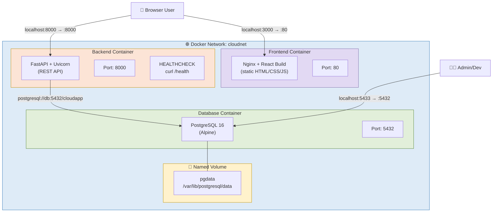
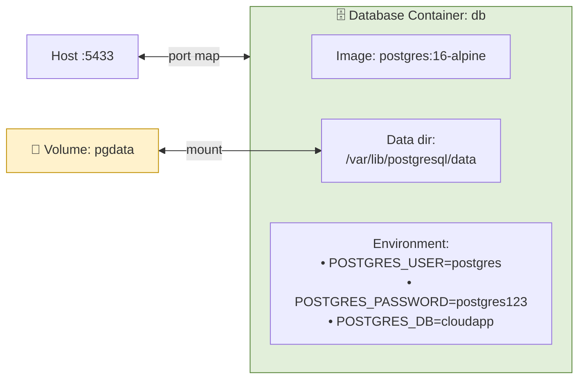
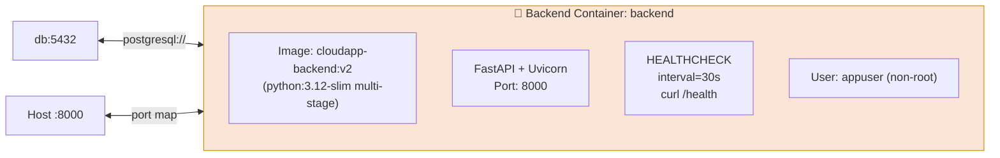
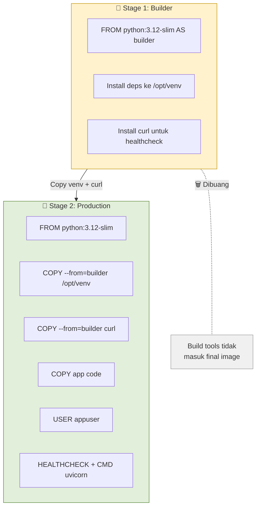
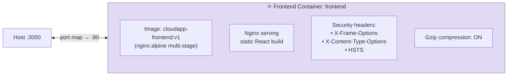
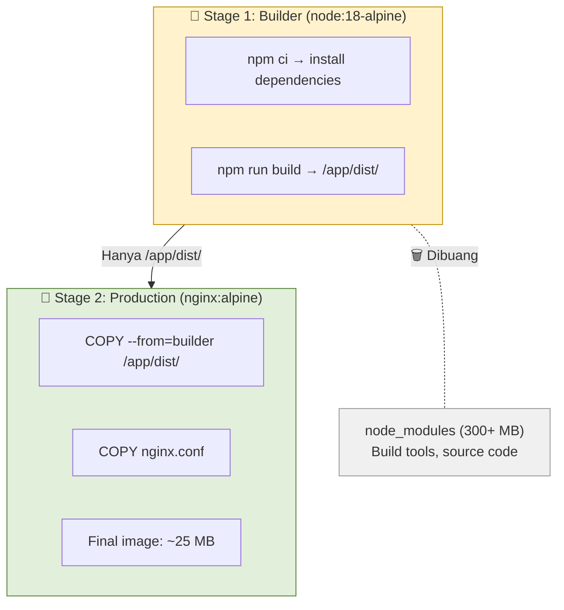
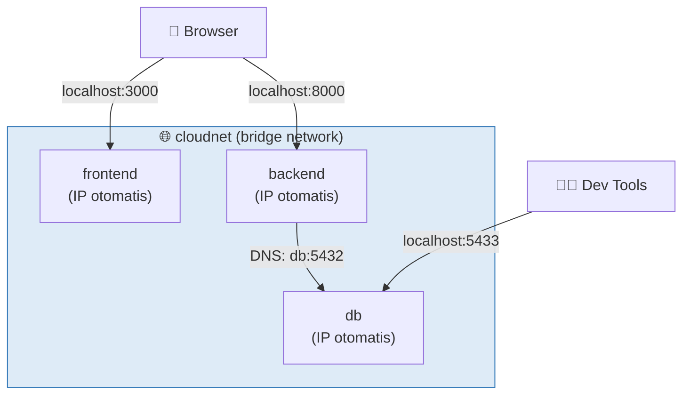
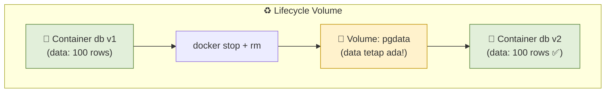
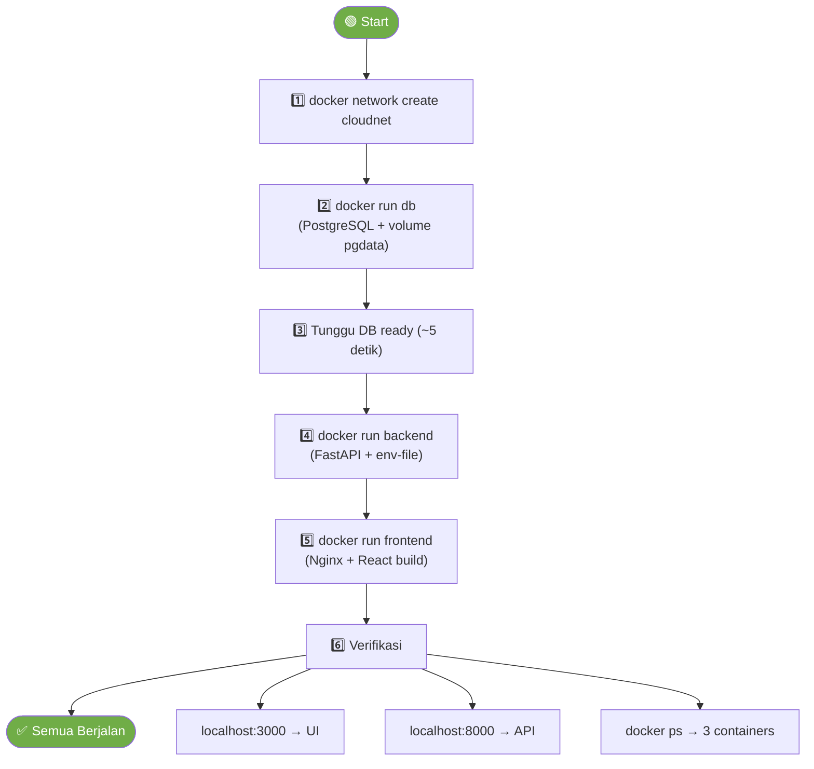

# 🐳 Arsitektur Multi-Container — PalmTrack Cloud

> Dokumentasi ini disusun oleh **Lead QA & Documentation** sebagai tugas Modul 6 — Docker Lanjutan.
>
> **Tujuan:** Menggambarkan arsitektur 3-container lengkap beserta ports, networks, volumes, dan environment variables yang digunakan.

---

## 1. Arsitektur Overview

Aplikasi PalmTrack Cloud berjalan dalam **3 container** yang saling terhubung melalui Docker custom network `cloudnet`.



---

## 2. Detail Setiap Container

### 2.1 Database Container (`db`)



| Konfigurasi | Nilai |
|-------------|-------|
| **Image** | `postgres:16-alpine` |
| **Container Name** | `db` |
| **Network** | `cloudnet` |
| **Port Mapping** | `5433:5432` (host:container) |
| **Volume** | `pgdata:/var/lib/postgresql/data` |
| **Database** | `cloudapp` |
| **Username** | `postgres` |
| **Password** | `postgres123` |

**Docker Run Command:**
```bash
docker run -d \
  --name db \
  --network cloudnet \
  -e POSTGRES_USER=postgres \
  -e POSTGRES_PASSWORD=postgres123 \
  -e POSTGRES_DB=cloudapp \
  -p 5433:5432 \
  -v pgdata:/var/lib/postgresql/data \
  postgres:16-alpine
```

> 💡 Port di-map ke `5433` (bukan `5432`) agar tidak bentrok dengan PostgreSQL lokal yang mungkin berjalan di host.

---

### 2.2 Backend Container (`backend`)



| Konfigurasi | Nilai |
|-------------|-------|
| **Image** | `cloudapp-backend:v2` |
| **Base Image** | `python:3.12-slim` (multi-stage build) |
| **Container Name** | `backend` |
| **Network** | `cloudnet` |
| **Port Mapping** | `8000:8000` (host:container) |
| **Env File** | `backend/.env.docker` |
| **User** | `appuser` (non-root) |
| **Healthcheck** | `curl -f http://localhost:8000/health` (interval: 30s) |

**Environment Variables (`backend/.env.docker`):**

| Variable | Nilai | Keterangan |
|----------|-------|------------|
| `DATABASE_URL` | `postgresql://postgres:postgres123@db:5432/cloudapp` | Menggunakan `db` (nama container) sebagai hostname |
| `SECRET_KEY` | `(random string 32+ karakter)` | Untuk signing JWT token |
| `ALGORITHM` | `HS256` | Algoritma JWT |
| `ACCESS_TOKEN_EXPIRE_MINUTES` | `60` | Token expire 1 jam |
| `ALLOWED_ORIGINS` | `http://localhost:3000,http://localhost:5173` | CORS whitelist |

**Docker Run Command:**
```bash
docker run -d \
  --name backend \
  --network cloudnet \
  --env-file backend/.env.docker \
  -p 8000:8000 \
  cloudapp-backend:v2
```

**Dockerfile (Multi-Stage Build):**



---

### 2.3 Frontend Container (`frontend`)



| Konfigurasi | Nilai |
|-------------|-------|
| **Image** | `cloudapp-frontend:v1` |
| **Base Image** | Stage 1: `node:18-alpine`, Stage 2: `nginx:alpine` |
| **Container Name** | `frontend` |
| **Network** | `cloudnet` |
| **Port Mapping** | `3000:80` (host:container) |
| **Build Arg** | `VITE_API_URL=http://localhost:8000` |

**Nginx Features:**
- ✅ SPA routing (`try_files → /index.html`)
- ✅ Static asset caching (1 tahun, immutable)
- ✅ No-cache untuk `index.html`
- ✅ Gzip compression (level 5)
- ✅ Security headers (X-Frame-Options, X-Content-Type-Options, HSTS, XSS Protection)
- ✅ Custom error pages (404, 50x)
- ✅ Server tokens disabled

**Docker Run Command:**
```bash
docker run -d \
  --name frontend \
  --network cloudnet \
  -p 3000:80 \
  cloudapp-frontend:v1
```

**Dockerfile (Multi-Stage Build):**



---

## 3. Network Architecture

### 3.1 Docker Network: `cloudnet`



### 3.2 Tabel Komunikasi

| Dari | Ke | URL/Hostname | Protokol | Keterangan |
|------|-----|-------------|----------|------------|
| Browser | Frontend | `localhost:3000` | HTTP | User akses UI |
| Browser | Backend | `localhost:8000` | HTTP | React fetch API (dari browser, bukan dari container) |
| Backend | Database | `db:5432` | PostgreSQL | DNS internal Docker network |
| Dev/Admin | Database | `localhost:5433` | PostgreSQL | Untuk debug via pgAdmin/psql |

> ⚠️ **Penting:** React app berjalan di **browser user**, bukan di dalam container frontend. Jadi saat React memanggil API, request dikirim dari browser ke `localhost:8000`, bukan dari container frontend ke container backend. Inilah mengapa `VITE_API_URL` di-set ke `http://localhost:8000` — bukan `http://backend:8000`.

### 3.3 Network Commands

```bash
# Buat network
docker network create cloudnet

# Lihat semua network
docker network ls

# Inspeksi network (lihat container anggota)
docker network inspect cloudnet

# Hapus network
docker network rm cloudnet
```

---

## 4. Volume Architecture

### 4.1 Named Volume: `pgdata`



| Konfigurasi | Nilai |
|-------------|-------|
| **Volume Name** | `pgdata` |
| **Mount Path** | `/var/lib/postgresql/data` |
| **Tipe** | Named Volume (managed by Docker) |
| **Persist** | ✅ Data tetap ada saat container dihapus |

### 4.2 Volume Commands

```bash
# Lihat semua volumes
docker volume ls

# Inspeksi volume
docker volume inspect pgdata

# Hapus volume (⚠️ data hilang!)
docker volume rm pgdata

# Hapus semua volume yang tidak terpakai
docker volume prune
```

---

## 5. Image Sizes

| Image | Build Type | Compressed | Uncompressed | Keterangan |
|-------|-----------|------------|--------------|------------|
| `cloudapp-backend:v1` | Single-stage | ~180 MB | ~450 MB | Modul 5 (deprecated) |
| `cloudapp-backend:v2` | ✅ Multi-stage | ~140 MB | ~305 MB | Modul 6 — 22% lebih kecil |
| `cloudapp-frontend:v1` | ✅ Multi-stage | ~25 MB | ~93 MB | Node.js build → Nginx serve |
| `postgres:16-alpine` | Official | ~100 MB | ~240 MB | Database |

---

## 6. Full Startup Sequence



**Urutan penting:**
1. **Network** harus dibuat dulu
2. **Database** harus start duluan (backend butuh koneksi DB)
3. **Backend** start setelah database siap
4. **Frontend** bisa start kapan saja (tidak depend ke container lain secara langsung)

---

## 7. Helper Script

Tim menyediakan `scripts/docker-run.sh` untuk mempermudah operasi:

```bash
# Start semua container
bash scripts/docker-run.sh start

# Stop semua container
bash scripts/docker-run.sh stop

# Cek status
bash scripts/docker-run.sh status

# Lihat logs
bash scripts/docker-run.sh logs backend
```

> 🚧 **Minggu 7:** Semua operasi manual ini akan digantikan oleh **Docker Compose** — satu file `docker-compose.yml`, satu perintah `docker compose up`.

---

## 8. Troubleshooting

| Problem | Penyebab | Solusi |
|---------|----------|--------|
| Backend error: "connection refused to db" | Database belum ready | Tunggu 5 detik setelah start DB, atau gunakan `wait-for-db.sh` |
| Frontend: halaman kosong | `VITE_API_URL` salah saat build | Rebuild dengan `--build-arg VITE_API_URL=http://localhost:8000` |
| Data hilang setelah restart DB | Tidak pakai volume | Pastikan `-v pgdata:/var/lib/postgresql/data` |
| Container tidak bisa saling akses | Beda network | Pastikan semua pakai `--network cloudnet` |
| Port already in use | Port sudah dipakai | Ganti port mapping, misal `-p 8001:8000` |

---

*Dokumentasi ini dibuat oleh Lead QA & Documentation — Modul 6: Docker Lanjutan*
*Tanggal: 13 April 2026*
