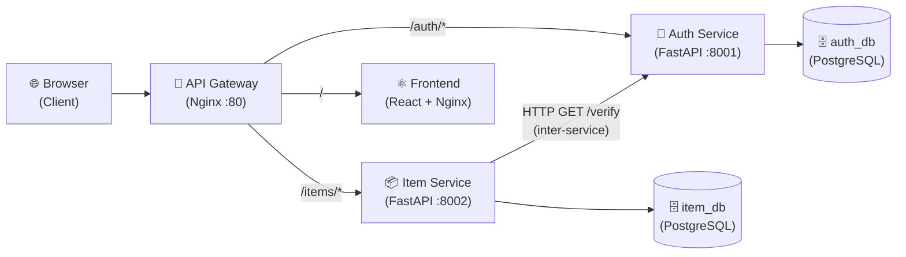
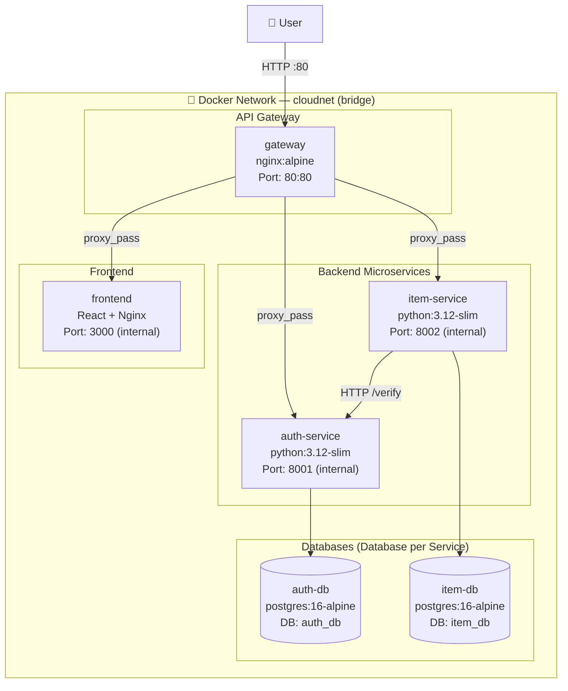
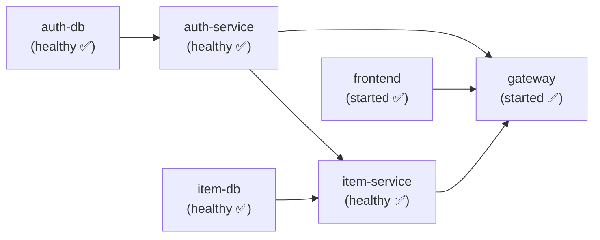
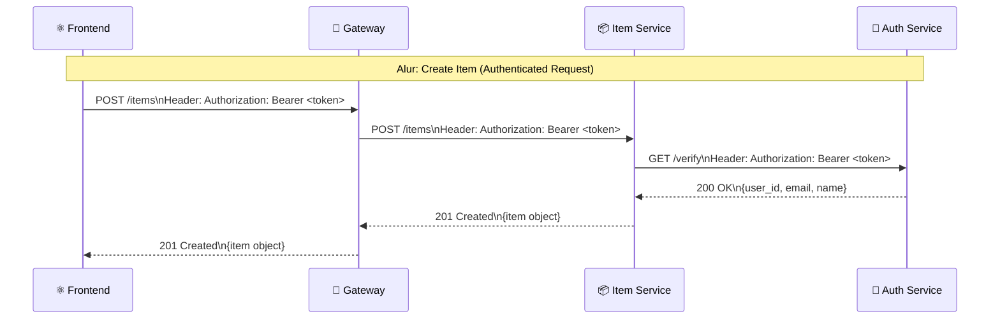

# Dokumentasi Arsitektur Microservices — PalmTrack Cloud (PalmChain)

> **Tanggal Dokumen:** 09 Juni 2026
> **Penulis:** Adonia Azarya Tamalonggehe (Lead QA & Documentation)
> **Versi Arsitektur:** 2.0 (Fase Microservices — Modul 12)
> **Mata Kuliah:** Komputasi Awan — Institut Teknologi Kalimantan

---

## 1. Ringkasan Perubahan Arsitektur

Pada fase ini, sistem PalmTrack Cloud bertransisi dari arsitektur **monolith** (1 backend, 1 database) menjadi arsitektur **microservices** (2 backend service terpisah, masing-masing dengan database sendiri), yang diatur melalui Docker Compose dan diakses melalui satu pintu masuk tunggal berupa **API Gateway (Nginx)**.

| Aspek | Sebelum (Monolith) | Sesudah (Microservices) |
|-------|-------------------|------------------------|
| Backend | 1 service (FastAPI, port 8000) | 2 service (auth-service :8001, item-service :8002) |
| Database | 1 PostgreSQL (`cloudapp`) | 2 PostgreSQL (`auth_db`, `item_db`) |
| Container | 3 container | 6 container |
| Pintu Masuk | Langsung ke backend | Via API Gateway (Nginx, port 80) |

---

## 2. Diagram Arsitektur Sistem

### 2.1 Gambaran Umum (High-Level)



### 2.2 Detail Container & Jaringan Docker



### 2.3 Urutan Startup Container (depends_on)



> **Catatan:** Gateway baru menyala setelah `auth-service` dan `item-service` keduanya berstatus `healthy`. Ini mencegah request masuk sebelum backend siap.

---

## 3. Prinsip Arsitektur yang Diterapkan

### 3.1 Database per Service
Setiap service memiliki database **sendiri** yang tidak bisa diakses langsung oleh service lain.

| Service | Database | Tabel |
|---------|----------|-------|
| Auth Service | `auth_db` | `users` |
| Item Service | `item_db` | `items` |

> ⚠️ Item Service **tidak memiliki foreign key** ke tabel `users` di `auth_db`. Referensi ke user hanya disimpan sebagai `owner_id` (integer) — konsistensi dijaga di level aplikasi, bukan database constraint.

### 3.2 Inter-Service Communication (Synchronous HTTP)
Item Service berkomunikasi dengan Auth Service secara **synchronous HTTP** untuk memverifikasi token JWT pada setiap request yang membutuhkan autentikasi.



### 3.3 API Gateway sebagai Single Entry Point
Seluruh request dari browser masuk melalui **satu pintu** yaitu Nginx gateway di port `80`. Routing dilakukan berdasarkan path prefix:

| Path | Diteruskan ke |
|------|--------------|
| `/auth/*` | auth-service:8001 |
| `/items` dan `/items/*` | item-service:8002 |
| `/health` | Gateway langsung (200 OK) |
| `/` dan lainnya | Frontend (React) |

---

## 4. Daftar Seluruh Container

| Container | Image | Port Internal | Fungsi |
|-----------|-------|--------------|--------|
| `gateway` | nginx:alpine | 80 (expose ke host) | API Gateway, reverse proxy, single entry point |
| `auth-service` | python:3.12-slim | 8001 | Autentikasi: register, login, verify token |
| `item-service` | python:3.12-slim | 8002 | Manajemen item: CRUD, search |
| `auth-db` | postgres:16-alpine | 5432 (internal) | Database khusus auth service |
| `item-db` | postgres:16-alpine | 5432 (internal) | Database khusus item service |
| `frontend` | node→nginx | 3000 (internal) | Aplikasi React yang di-serve Nginx |

---

## 5. Healthcheck & Dependency Chain

| Container | Healthcheck Method | Interval | Dependency |
|-----------|--------------------|----------|------------|
| `auth-db` | `pg_isready -U postgres` | 5s | — |
| `item-db` | `pg_isready -U postgres` | 5s | — |
| `auth-service` | `python urllib → :8001/health` | 10s | auth-db (healthy) |
| `item-service` | `python urllib → :8002/health` | 10s | item-db (healthy) + auth-service (healthy) |
| `gateway` | — | — | auth-service (healthy) + item-service (healthy) + frontend (started) |
| `frontend` | — | — | — |

> **Catatan:** Healthcheck backend menggunakan `python urllib` (bukan `curl`) karena image `python:3.12-slim` tidak menyertakan curl secara default.

---

## 6. Cara Menjalankan Sistem (Quick Reference)

```bash
# Development — build dan jalankan semua 6 container
docker compose up --build -d

# Cek status semua container
docker compose ps

# Cek apakah semua container healthy
docker compose ps --format "table {{.Name}}\t{{.Status}}"

# Lihat logs real-time
docker compose logs -f

# Akses aplikasi
# Frontend  : http://localhost
# API Docs  : http://localhost/auth/docs  (Auth Service)
# API Docs  : http://localhost/items/docs (Item Service — jika diaktifkan)

# Stop semua container (data tetap)
docker compose down

# Reset total (hapus semua data)
docker compose down -v
```

---

*Dokumentasi ini disusun oleh **Adonia Azarya Tamalonggehe** (Lead QA & Documentation) sebagai deliverable Modul 12 — Microservices Architecture.*
*Institut Teknologi Kalimantan — Komputasi Awan 2026.*
