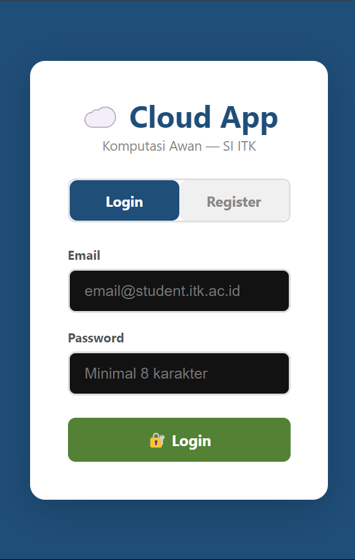
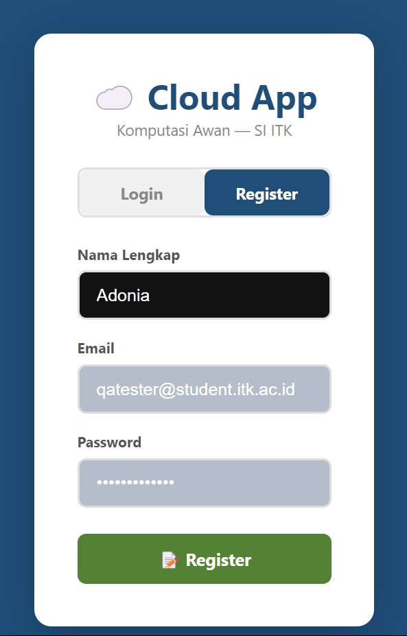
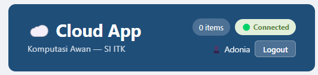
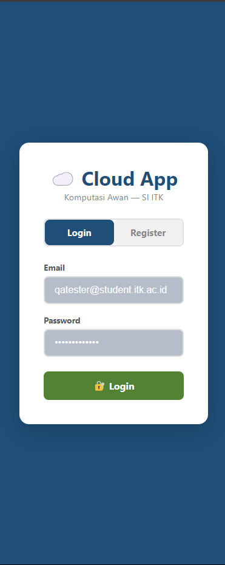
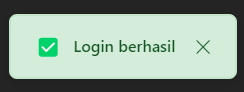
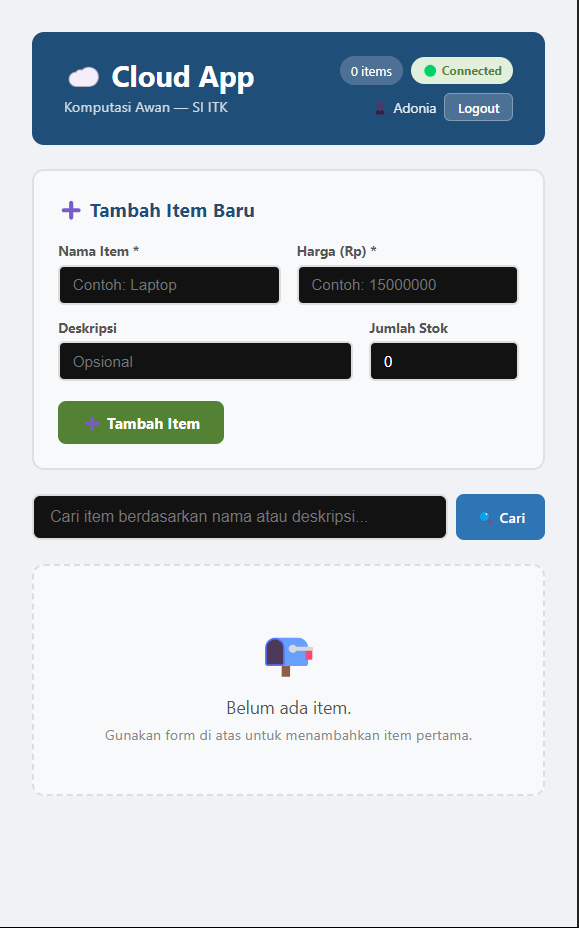
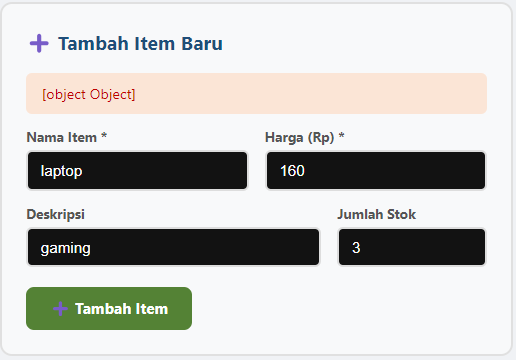

# 🧪 Auth Test Results — Modul 4

> Dokumentasi ini disusun oleh **Lead QA & Documentation** (Adonia Azarya Tamalonggehe)  
> Tanggal Testing: 22 Maret 2026  
> Modul: **Modul 4 — Integrasi Full-Stack: CORS, ENV Variables & JWT Auth**

---

## 📋 Ringkasan Hasil Testing

| Kategori | Total | ✅ Pass | ❌ Fail | ⚠️ Bug |
|----------|-------|---------|---------|--------|
| Backend (Swagger UI) | 5 | 5 | 0 | 0 |
| Frontend (Browser) | 6 | 6 | 0 | 1 |
| **Total** | **11** | **11** | **0** | **1** |

---

## 🔧 FASE 1 — Backend Testing via Swagger UI

**URL:** `http://localhost:8000/docs`

---

### TC-AUTH-01 — Register User Baru

| Item | Detail |
|------|--------|
| **Endpoint** | `POST /auth/register` |
| **Input** | `email: tester@student.itk.ac.id`, `name: QA Tester`, `password: password123!` |
| **Expected** | `201 Created` — user terbuat, response berisi `id`, `email`, `name`, `is_active` |
| **Actual** | `201 Created` ✅ |
| **Status** | ✅ **PASS** |

**Catatan:** Password *tanpa* special character (misal `password123`) akan ditolak dengan error `422` — validasi password strength dari Lead Backend berfungsi dengan benar.

---

### TC-AUTH-02 — Register Email Duplikat (Negative Test)

| Item | Detail |
|------|--------|
| **Endpoint** | `POST /auth/register` |
| **Input** | Email yang sama dengan TC-AUTH-01 |
| **Expected** | `400 Bad Request` — `{"detail": "Email sudah terdaftar"}` |
| **Actual** | `400 Bad Request` ✅ |
| **Status** | ✅ **PASS** |

---

### TC-AUTH-03 — Login & Dapatkan Token

| Item | Detail |
|------|--------|
| **Endpoint** | `POST /auth/login` |
| **Input** | `email: tester@student.itk.ac.id`, `password: password123!` |
| **Expected** | `200 OK` — response berisi `access_token` |
| **Actual** | `200 OK` — `access_token` berhasil didapat ✅ |
| **Status** | ✅ **PASS** |

---

### TC-AUTH-04 — Akses `/items` Tanpa Token (Negative Test)

| Item | Detail |
|------|--------|
| **Endpoint** | `GET /items` (tanpa Authorization header) |
| **Expected** | `401 Unauthorized` |
| **Actual** | `401 Unauthorized` ✅ |
| **Status** | ✅ **PASS** |

---

### TC-AUTH-05 — Akses `/items` Dengan Token

| Item | Detail |
|------|--------|
| **Endpoint** | `GET /items` (dengan Bearer token dari TC-AUTH-03) |
| **Expected** | `200 OK` — daftar items berhasil dimuat |
| **Actual** | `200 OK` ✅ |
| **Status** | ✅ **PASS** |

---

## 🌐 FASE 2 — Frontend Testing via Browser

**URL:** `http://localhost:5173`

---

### TC-UI-11 — Login Page Muncul saat Buka App

| Item | Detail |
|------|--------|
| **Langkah** | Buka `http://localhost:5173` |
| **Expected** | Halaman login tampil (bukan langsung main app) |
| **Actual** | Login page muncul ✅ |
| **Status** | ✅ **PASS** |



---

### TC-UI-12 — Register User Baru via UI

| Item | Detail |
|------|--------|
| **Langkah** | Klik tab Register → isi nama, email, password (mengandung special character) → klik Register |
| **Expected** | Registrasi berhasil |
| **Actual** | Berhasil terdaftar ✅ |
| **Status** | ✅ **PASS** |



---

### TC-UI-13 — Otomatis Login Setelah Register

| Item | Detail |
|------|--------|
| **Langkah** | Setelah register berhasil |
| **Expected** | Langsung masuk ke main app tanpa harus login manual |
| **Actual** | Otomatis masuk ke main app ✅ |
| **Status** | ✅ **PASS** |


---

### TC-UI-14 — Nama User Tampil di Header

| Item | Detail |
|------|--------|
| **Langkah** | Lihat bagian kanan atas header setelah login |
| **Expected** | Muncul `👤 [nama user]` dan tombol Logout |
| **Actual** | Nama user dan tombol Logout tampil ✅ |
| **Status** | ✅ **PASS** |



---

### TC-UI-15 — Logout → Kembali ke Login Page

| Item | Detail |
|------|--------|
| **Langkah** | Klik tombol Logout di header |
| **Expected** | Kembali ke halaman login |
| **Actual** | Berhasil kembali ke login page ✅ |
| **Status** | ✅ **PASS** |



---

### TC-UI-16 — Login Ulang → Data Masih Ada

| Item | Detail |
|------|--------|
| **Langkah** | Login ulang dengan akun yang sama |
| **Expected** | Data items sebelumnya masih ada (persistent di database) |
| **Actual** | Data items tetap ada ✅ |
| **Status** | ✅ **PASS** |





---

## 🐛 Bug Report

### BUG-04-01 — Create & Update Item via UI Gagal (Missing `Content-Type` Header)

| Item | Detail |
|------|--------|
| **ID** | BUG-04-01 |
| **Severity** | 🔴 High — fitur utama tidak berfungsi |
| **File** | `frontend/src/services/api.js`, baris 88 & 97 |
| **Endpoint Terdampak** | `POST /items`, `PUT /items/{id}` |
| **Ditemukan saat** | TC-UI (percobaan tambah item via frontend) |

**Deskripsi:**

Fungsi `createItem()` dan `updateItem()` di `api.js` tidak menyertakan header `Content-Type: application/json` saat mengirim request ke backend. Akibatnya, backend FastAPI tidak dapat mem-parse body request sebagai JSON object dan mengembalikan error `422 Unprocessable Content`.

**Error Response dari Server:**
```json
{
  "detail": [
    {
      "type": "model_attributes_type",
      "loc": ["body"],
      "msg": "Input should be a valid dictionary or object to extract fields from",
      "input": "{\"name\":\"laptop\",\"description\":\"gaming\",\"price\":160,\"quantity\":3}"
    }
  ]
}
```

**Screenshot:**



**Root Cause:**

```javascript
// ❌ Sekarang (bug) — hanya ada Authorization, tidak ada Content-Type
headers: authHeaders()

// ✅ Seharusnya — tambahkan Content-Type: application/json
headers: { ...authHeaders(), "Content-Type": "application/json" }
```

**Assignee:** Lead Frontend — Alfian Fadillah Putra  
**Status:** ❌ Belum difix  
**Workaround:** Gunakan Swagger UI (`http://localhost:8000/docs`) untuk operasi tambah/update item sementara bug ini belum diperbaiki.

---

## ✅ Checklist Testing Modul 4

### Backend (Swagger UI)
- [x] `POST /auth/register` — user baru berhasil dibuat (201)
- [x] `POST /auth/register` duplikat → 400 Bad Request
- [x] Validasi password strength (tanpa special char → 422) berfungsi
- [x] `POST /auth/login` — token JWT berhasil didapat (200)
- [x] `GET /items` tanpa token → 401 Unauthorized
- [x] `GET /items` dengan token → 200 OK

### Frontend (Browser)
- [x] Login page muncul saat buka `localhost:5173`
- [x] Register via UI berhasil
- [x] Otomatis login setelah register
- [x] Nama user tampil di header
- [x] Tombol Logout berfungsi → kembali ke login page
- [x] Login ulang → data items tetap ada (persistent)
- [ ] ~~Tambah item via UI~~ ❌ **Bug BUG-04-01**
- [ ] ~~Update item via UI~~ ❌ **Bug BUG-04-01**

---

*Dokumentasi ini dikelola oleh **Adonia Azarya Tamalonggehe** (Lead QA & Documentation).*  
*Institut Teknologi Kalimantan — Komputasi Awan 2026.*
