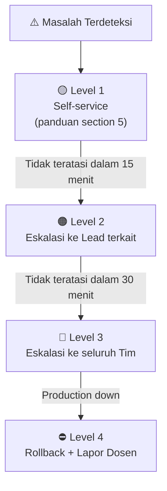

# Operations Guide — PalmTrack Cloud (PalmChain)

> **Tanggal Dokumen:** 09 Juni 2026
> **Penulis:** Adonia Azarya Tamalonggehe (Lead QA & Documentation)
> **Fase:** Production Readiness (Modul 14)
> **Mata Kuliah:** Komputasi Awan — Institut Teknologi Kalimantan

---

## Pendahuluan

Dokumen ini adalah **panduan operasional harian** untuk tim yang mengelola sistem PalmTrack Cloud di lingkungan production. Dokumen ini mencakup cara memantau kesehatan sistem, membaca log, menelusuri request, memeriksa metrik, menangani masalah umum, dan prosedur eskalasi.

**Sistem yang dikelola:** 6 container Docker (gateway, auth-service, item-service, auth-db, item-db, frontend)

---

## 1. Cara Check Health

### 1.1 Health Check Cepat (Semua Service Sekaligus)

```bash
# Lihat status dan kondisi semua container
docker compose ps

# Output yang diharapkan di production:
# NAME           STATUS                  PORTS
# gateway        Up X hours (healthy)    0.0.0.0:80->80/tcp
# auth-service   Up X hours (healthy)
# item-service   Up X hours (healthy)
# auth-db        Up X hours (healthy)
# item-db        Up X hours (healthy)
# frontend       Up X hours

# Atau gunakan Makefile:
make status
```

### 1.2 Health Check per Service via HTTP

```bash
# Gateway (pintu masuk utama)
curl -s http://localhost/health
# Expected: {"status":"healthy","service":"gateway"}

# Auth Service (via gateway)
curl -s http://localhost/auth/health
# Expected: {"status":"healthy","service":"auth-service","version":"2.0.0"}

# Item Service (via gateway) — butuh token
curl -s http://localhost/items/health
# Expected: {"status":"healthy","service":"item-service","version":"2.0.0"}
```

### 1.3 Health Check Otomatis (Docker Healthcheck)

Setiap service sudah dikonfigurasi dengan healthcheck otomatis di `docker-compose.yml`. Docker akan otomatis menandai container sebagai `unhealthy` jika endpoint `/health` tidak merespons dalam batas waktu yang ditentukan.

| Service | Method | Interval | Timeout | Retries |
|---------|--------|----------|---------|---------|
| `auth-db` | `pg_isready -U postgres` | 5s | 5s | 5 |
| `item-db` | `pg_isready -U postgres` | 5s | 5s | 5 |
| `auth-service` | `python urllib → :8001/health` | 10s | 5s | 3 |
| `item-service` | `python urllib → :8002/health` | 10s | 5s | 3 |

### 1.4 Interpretasi Status Container

| Status Docker | Artinya | Tindakan |
|--------------|---------|----------|
| `running (healthy)` | ✅ Normal | Tidak ada tindakan |
| `running (unhealthy)` | ⚠️ Service jalan tapi tidak merespons | Cek log service tersebut |
| `running (health: starting)` | ⏳ Baru saja dimulai, menunggu | Tunggu 15-30 detik |
| `exited` | ❌ Container mati | Restart segera, cek log |
| `restarting` | 🔄 Sedang restart otomatis | Pantau apakah stabil |

---

## 2. Cara Baca Log

### 2.1 Log Real-time Semua Service

```bash
# Lihat log semua service secara live
docker compose logs -f

# Hanya backend services (paling sering dibutuhkan)
docker compose logs -f auth-service item-service

# Gunakan helper script (dari Varrel - Lead DevOps):
./scripts/logs.sh all
```

### 2.2 Log Spesifik Per Service

```bash
# Log auth-service saja
docker compose logs -f auth-service

# Log item-service saja
docker compose logs -f item-service

# Log gateway (request masuk)
docker compose logs -f gateway

# Log database (jarang diperlukan, kecuali ada masalah DB)
docker compose logs -f auth-db
docker compose logs -f item-db
```

### 2.3 Filter Log Berdasarkan Level

```bash
# Tampilkan hanya ERROR logs
./scripts/logs.sh errors

# Atau manual dengan grep:
docker compose logs auth-service item-service 2>&1 | grep '"level":"ERROR"'

# Filter WARNING ke atas
docker compose logs auth-service item-service 2>&1 | grep -E '"level":"(WARNING|ERROR|CRITICAL)"'
```

### 2.4 Membaca Format Log (Structured JSON)

Log service menggunakan format **JSON terstruktur**. Contoh baris log:

```json
{
  "timestamp": "2026-06-09T00:30:15.123Z",
  "level": "INFO",
  "service": "auth-service",
  "method": "POST",
  "path": "/login",
  "status_code": 200,
  "duration_ms": 145,
  "correlation_id": "req-a1b2c3d4-e5f6",
  "user_id": 7
}
```

| Field | Keterangan |
|-------|------------|
| `timestamp` | Waktu request terjadi (UTC) |
| `level` | `DEBUG` / `INFO` / `WARNING` / `ERROR` / `CRITICAL` |
| `service` | Nama service yang menghasilkan log |
| `method` | HTTP method (`GET`, `POST`, dll) |
| `path` | Endpoint yang diakses |
| `status_code` | HTTP status code response |
| `duration_ms` | Berapa milidetik request diselesaikan |
| `correlation_id` | ID unik untuk melacak satu request di semua service |
| `user_id` | ID user yang melakukan request (jika sudah login) |

### 2.5 Log Berdasarkan Waktu Tertentu

```bash
# Log dari 1 jam terakhir
docker compose logs --since 1h auth-service

# Log dari waktu tertentu
docker compose logs --since "2026-06-09T00:00:00" auth-service

# Log N baris terakhir saja
docker compose logs --tail 100 auth-service
```

---

## 3. Cara Trace Request (Correlation ID)

### 3.1 Apa itu Correlation ID?

Setiap request yang masuk ke Gateway diberi **Correlation ID** unik (contoh: `req-a1b2c3d4`). ID ini diteruskan ke semua service yang dipanggil, sehingga kita bisa melacak perjalanan satu request di seluruh sistem.

```
Browser → Gateway → Item Service → Auth Service
           |req-a1b2|  |req-a1b2|    |req-a1b2|
```

### 3.2 Mendapatkan Correlation ID

**Dari response header:**
```bash
curl -v -H "Authorization: Bearer $TOKEN" http://localhost/items 2>&1 | grep -i "x-correlation-id"
# → X-Correlation-ID: req-a1b2c3d4-e5f6
```

**Dari log saat terjadi error:**
```bash
# Cari log error terbaru
docker compose logs auth-service item-service 2>&1 | grep '"level":"ERROR"' | tail -5
# → Temukan field "correlation_id" di dalam log JSON tersebut
```

### 3.3 Melacak Request dengan Correlation ID

Setelah mendapatkan Correlation ID, lacak perjalanan request tersebut di semua service:

```bash
# Cara 1: Gunakan helper script (paling mudah)
./scripts/logs.sh trace req-a1b2c3d4-e5f6

# Cara 2: Manual grep di semua service
docker compose logs auth-service item-service 2>&1 | grep "req-a1b2c3d4-e5f6"

# Cara 3: Grep di satu service spesifik
docker compose logs item-service 2>&1 | grep "req-a1b2c3d4-e5f6"
docker compose logs auth-service 2>&1 | grep "req-a1b2c3d4-e5f6"
```

### 3.4 Membaca Hasil Trace

Output trace akan menampilkan urutan lengkap satu request:

```
item-service  | {"timestamp":"...","correlation_id":"req-a1b2","path":"/items","status":200,"duration_ms":185}
auth-service  | {"timestamp":"...","correlation_id":"req-a1b2","path":"/verify","status":200,"duration_ms":32}
```

Dari output ini bisa diketahui:
- **Total request duration:** 185ms (item-service)
- **Auth verification:** 32ms (auth-service)
- **Item service processing:** 185 - 32 = 153ms
- **Bottleneck:** ada di item-service (query database)

---

## 4. Cara Check Metrics

### 4.1 Metrics via Helper Script

```bash
# Ambil metrics dari kedua service sekaligus
./scripts/logs.sh metrics

# Output:
# --- Auth Service ---
# { "requests_total": 1523, "errors_total": 12, "error_rate": 0.0079, ... }
# --- Item Service ---
# { "requests_total": 891, "errors_total": 3, "error_rate": 0.0034, ... }
```

### 4.2 Metrics via HTTP Langsung

```bash
# Auth Service metrics
curl -s http://localhost/auth/metrics | python3 -m json.tool

# Item Service metrics
curl -s http://localhost/items/metrics | python3 -m json.tool
```

### 4.3 Memahami Data Metrics

```json
{
  "requests_total": 1523,
  "errors_total": 12,
  "error_rate": 0.0079,
  "avg_latency_ms": 142.5,
  "endpoints": {
    "POST /login": { "count": 450, "errors": 5, "avg_ms": 185 },
    "GET /verify": { "count": 891, "errors": 2, "avg_ms": 32 },
    "POST /register": { "count": 182, "errors": 5, "avg_ms": 220 }
  }
}
```

| Metrik | Normal | Perlu Perhatian | Kritis |
|--------|--------|----------------|--------|
| `error_rate` | < 1% | 1% – 5% | > 5% |
| `avg_latency_ms` | < 200ms | 200ms – 500ms | > 500ms |
| `requests_total` | Naik konsisten | — | Tiba-tiba 0 (service mati) |

### 4.4 Health Dashboard (Status Page)

Buka browser ke: **http://localhost/status**

Dashboard akan menampilkan:
- Status real-time semua 6 container
- Error rate per service
- Average latency per endpoint
- Auto-refresh setiap 30 detik

---

## 5. Common Troubleshooting

### ❌ Masalah: Container Status `unhealthy`

```bash
# Langkah 1: Cek log container yang bermasalah
docker compose logs --tail 50 <nama-container>

# Langkah 2: Masuk ke dalam container untuk debug
docker compose exec <nama-container> bash

# Langkah 3: Test healthcheck secara manual
# Untuk auth-service:
docker compose exec auth-service python3 -c \
  "import urllib.request; print(urllib.request.urlopen('http://localhost:8001/health').read())"

# Langkah 4: Restart container jika diperlukan
docker compose restart <nama-container>
```

---

### ❌ Masalah: `503 Auth service unavailable` di semua request

**Penyebab:** Auth Service mati atau tidak bisa dihubungi oleh Item Service.

```bash
# Cek apakah auth-service jalan
docker compose ps auth-service

# Cek log auth-service
docker compose logs --tail 30 auth-service

# Cek apakah item-service bisa reach auth-service
docker compose exec item-service python3 -c \
  "import urllib.request; print(urllib.request.urlopen('http://auth-service:8001/health').read())"

# Solusi: Restart auth-service
docker compose restart auth-service

# Tunggu sampai healthy
docker compose ps auth-service
```

---

### ❌ Masalah: `401 Unauthorized` padahal token baru saja didapat

**Penyebab:** SECRET_KEY berbeda antara restart, atau token expired.

```bash
# Cek apakah SECRET_KEY sudah dikonfigurasi di environment
docker compose exec auth-service env | grep SECRET_KEY

# Jika SECRET_KEY kosong atau default, set di .env atau docker-compose.yml
# Lalu restart:
docker compose restart auth-service item-service

# Login ulang untuk dapat token baru
curl -X POST http://localhost/auth/login \
  -H "Content-Type: application/json" \
  -d '{"email":"user@example.com","password":"password123"}'
```

---

### ❌ Masalah: Frontend tidak bisa load (`502 Bad Gateway`)

**Penyebab:** Frontend container crash atau gateway tidak bisa reach frontend.

```bash
# Cek status gateway dan frontend
docker compose ps gateway frontend

# Cek log gateway untuk melihat error proxy
docker compose logs --tail 20 gateway

# Cek log frontend
docker compose logs --tail 20 frontend

# Restart gateway dan frontend
docker compose restart frontend gateway
```

---

### ❌ Masalah: Database error / data tidak tersimpan

**Penyebab:** Container database mati atau koneksi terputus.

```bash
# Cek status database
docker compose ps auth-db item-db

# Test koneksi ke auth-db
docker compose exec auth-db pg_isready -U postgres

# Test koneksi ke item-db
docker compose exec item-db pg_isready -U postgres

# Masuk ke database untuk cek data
docker compose exec auth-db psql -U postgres -d auth_db -c "SELECT COUNT(*) FROM users;"
docker compose exec item-db psql -U postgres -d item_db -c "SELECT COUNT(*) FROM items;"

# Jika DB mati, restart (data tidak hilang karena pakai named volume)
docker compose restart auth-db item-db
```

---

### ❌ Masalah: Disk penuh karena log terlalu besar

**Penyebab:** Log driver belum dikonfigurasi atau sudah melebihi batas rotasi.

```bash
# Cek ukuran log Docker
docker system df

# Cek log file yang ada (lokasi default Docker)
du -sh /var/lib/docker/containers/*/

# Bersihkan log lama (hati-hati: log akan hilang)
docker compose down
docker system prune -f

# Pastikan konfigurasi rotasi log sudah ada di docker-compose.yml:
# logging:
#   driver: "json-file"
#   options:
#     max-size: "10m"
#     max-file: "3"
```

---

### ❌ Masalah: Semua container tidak bisa start

**Penyebab:** Port conflict, Docker tidak jalan, atau resource kurang.

```bash
# Cek apakah port 80 sudah dipakai proses lain
netstat -tulpn | grep :80

# Restart Docker Engine jika diperlukan (Windows)
# Klik kanan Docker Desktop di tray → Restart

# Hard reset total (HATI-HATI: data akan hilang!)
docker compose down -v
docker builder prune -f
docker compose up --build -d
```

---

## 6. Escalation Path

Jika masalah tidak bisa diselesaikan dengan panduan di atas, ikuti jalur eskalasi berikut:



### Level 1 — Self-Service (0–15 menit)
Coba selesaikan sendiri menggunakan panduan di Section 5 dokumen ini.

### Level 2 — Eskalasi ke Lead Terkait (15–30 menit)

| Jenis Masalah | Eskalasi ke | Kontak |
|---------------|-------------|--------|
| Backend crash / API error | **Lead Backend** | @adamimir |
| Frontend tidak load / UI error | **Lead Frontend** | @alvhayen |
| Container tidak bisa start / Docker issue | **Lead DevOps** | @VarrelKaleb89 |
| CI/CD pipeline gagal | **Lead CI/CD** | @10231005 |
| Dokumentasi / prosedur tidak jelas | **Lead QA & Docs** | @Adonia76 |

### Level 3 — Eskalasi ke Seluruh Tim (30–60 menit)
Jika masalah melibatkan lebih dari satu komponen atau Lead terkait tidak bisa dihubungi, buat pesan di grup tim dengan format:

```
🚨 INCIDENT REPORT
Waktu: [timestamp]
Komponen: [service/fitur yang bermasalah]
Dampak: [apa yang tidak bisa dilakukan user]
Error: [pesan error / screenshot]
Yang sudah dicoba: [langkah troubleshooting yang sudah dilakukan]
Butuh bantuan: [apa yang dibutuhkan]
```

### Level 4 — Rollback (Production Down)

Jika production tidak bisa dipulihkan dalam 60 menit, lakukan rollback ke commit stabil terakhir:

```bash
# 1. Identifikasi commit stabil terakhir
git log --oneline -10

# 2. Revert commit buruk (TIDAK menghapus history)
git checkout main
git pull origin main
git revert <SHA-COMMIT-YANG-BERMASALAH> --no-edit

# 3. Push revert — CD pipeline akan otomatis deploy ulang
git push origin main

# 4. Monitor recovery
docker compose logs -f
```

> **Panduan rollback lengkap:** lihat [`docs/deployment-guide.md`](./deployment-guide.md)

---

## Quick Reference Card

```bash
# ─── HEALTH ────────────────────────────────────────────────
docker compose ps                          # Status semua container
curl http://localhost/health               # Health gateway
curl http://localhost/auth/health          # Health auth-service

# ─── LOGS ──────────────────────────────────────────────────
docker compose logs -f auth-service        # Log real-time auth
./scripts/logs.sh all                      # Log semua service
./scripts/logs.sh errors                   # Hanya ERROR logs

# ─── TRACING ───────────────────────────────────────────────
./scripts/logs.sh trace <correlation-id>   # Trace satu request

# ─── METRICS ───────────────────────────────────────────────
./scripts/logs.sh metrics                  # Metrics semua service
curl http://localhost/auth/metrics         # Metrics auth-service

# ─── RESTART ───────────────────────────────────────────────
docker compose restart <service>           # Restart satu service
docker compose restart                     # Restart semua service

# ─── PRODUCTION ────────────────────────────────────────────
make dev                                   # Jalankan mode development
make prod                                  # Jalankan mode production
make status                                # Cek status container
```

---

*Dokumen ini disusun oleh **Adonia Azarya Tamalonggehe** (Lead QA & Documentation) sebagai deliverable Modul 14 — Production Readiness.*
*Institut Teknologi Kalimantan — Komputasi Awan 2026.*
