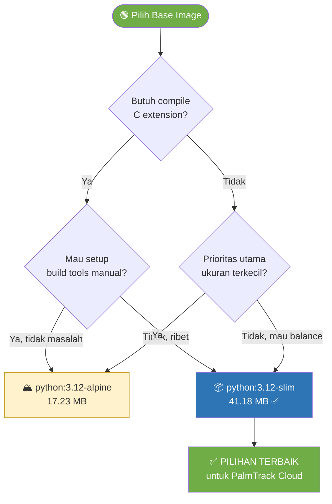

# 📦 Perbandingan Ukuran Docker Image Python 3.12

> Dokumentasi ini disusun oleh **Lead QA & Documentation** sebagai tugas Modul 5 — Docker Fundamentals.
> 
> **Tujuan:** Membandingkan ukuran base image `python:3.12`, `python:3.12-slim`, dan `python:3.12-alpine` untuk menentukan pilihan terbaik bagi proyek PalmTrack Cloud.

---

## 1. Data Ukuran Image

Data diambil dari [Docker Hub — Official Python Images](https://hub.docker.com/_/python/tags?name=3.12) pada **2 April 2026**, arsitektur **linux/amd64**.

### 1.1 Ukuran Base Image (Tanpa Dependencies Aplikasi)

| Image Tag | Compressed (Download) | Uncompressed (Disk) | Base OS |
|-----------|----------------------|---------------------|---------|
| `python:3.12` | **362.7 MB** | ~1 GB | Debian Bookworm (full) |
| `python:3.12-slim` | **41.18 MB** | ~150 MB | Debian Bookworm (minimal) |
| `python:3.12-alpine` | **17.23 MB** | ~55 MB | Alpine Linux |

### 1.2 Visualisasi Perbandingan Ukuran (Compressed)

```
python:3.12         ██████████████████████████████████████████████████  362.7 MB
python:3.12-slim    █████░░░░░░░░░░░░░░░░░░░░░░░░░░░░░░░░░░░░░░░░░░░   41.2 MB
python:3.12-alpine  ██░░░░░░░░░░░░░░░░░░░░░░░░░░░░░░░░░░░░░░░░░░░░░░   17.2 MB
```

### 1.3 Perbandingan Relatif

| Perbandingan | Rasio |
|-------------|-------|
| `3.12` vs `3.12-slim` | **8.8x lebih besar** |
| `3.12` vs `3.12-alpine` | **21x lebih besar** |
| `3.12-slim` vs `3.12-alpine` | **2.4x lebih besar** |

---

## 2. Detail Perbedaan Setiap Varian

### 2.1 `python:3.12` (Full Image)

| Aspek | Detail |
|-------|--------|
| **Base OS** | Debian Bookworm (full) |
| **Ukuran compressed** | 362.7 MB |
| **Isi** | Python runtime + pip + build tools (gcc, make, dll) + development headers + system utilities lengkap |
| **C Library** | glibc |
| **Keunggulan** | Semua dependency bisa langsung install tanpa error; ideal untuk development |
| **Kelemahan** | Sangat besar; banyak tool yang tidak diperlukan di production |
| **Cocok untuk** | Development, debugging, image yang butuh compile C extension |

### 2.2 `python:3.12-slim` (Recommended ✅)

| Aspek | Detail |
|-------|--------|
| **Base OS** | Debian Bookworm (minimal) |
| **Ukuran compressed** | 41.18 MB |
| **Isi** | Python runtime + pip, **tanpa** build tools, headers, dan utilities yang tidak esensial |
| **C Library** | glibc |
| **Keunggulan** | Ukuran kecil + kompatibel dengan hampir semua pip package (pre-built wheels); keseimbangan terbaik |
| **Kelemahan** | Jika butuh compile C extension, perlu install build tools secara manual |
| **Cocok untuk** | ✅ **Production** — pilihan paling direkomendasikan |

### 2.3 `python:3.12-alpine` (Smallest)

| Aspek | Detail |
|-------|--------|
| **Base OS** | Alpine Linux |
| **Ukuran compressed** | 17.23 MB |
| **Isi** | Python runtime + pip, menggunakan `musl libc` sebagai pengganti `glibc` |
| **C Library** | musl libc |
| **Keunggulan** | Paling kecil; attack surface paling rendah (security) |
| **Kelemahan** | ⚠️ Banyak package Python (`numpy`, `pandas`, `psycopg2-binary`, `cryptography`) **tidak punya pre-built wheel** untuk Alpine → harus compile dari source → build jadi sangat **lambat** dan perlu install `gcc`, `musl-dev`, dll → ukuran final bisa membengkak |
| **Cocok untuk** | Aplikasi pure Python tanpa C extension; microservices sangat ringan |

---

## 3. Analisis untuk Proyek PalmTrack Cloud

### 3.1 Dependencies PalmTrack Cloud yang Relevan

Berdasarkan `backend/requirements.txt`, proyek kita menggunakan:

| Package | Butuh C Compilation? | Kompatibilitas Alpine |
|---------|----------------------|----------------------|
| `fastapi==0.115.0` | ❌ Pure Python | ✅ |
| `uvicorn==0.30.0` | ❌ Pure Python | ✅ |
| `sqlalchemy==2.0.35` | ❌ Pure Python | ✅ |
| `psycopg2-binary==2.9.9` | ✅ **Ya** (C extension) | ⚠️ Perlu compile manual |
| `python-dotenv==1.0.1` | ❌ Pure Python | ✅ |
| `pydantic[email]==2.9.0` | ✅ **Ya** (Rust extension) | ⚠️ Perlu compile manual |
| `python-jose[cryptography]==3.3.0` | ✅ **Ya** (C extension) | ⚠️ Perlu compile manual |
| `passlib[bcrypt]==1.7.4` | ✅ **Ya** (C extension) | ⚠️ Perlu compile manual |
| `bcrypt==4.0.1` | ✅ **Ya** (C extension) | ⚠️ Perlu compile manual |

> ⚠️ **5 dari 10 dependency** membutuhkan C compilation, yang berarti **Alpine bukan pilihan ideal** untuk proyek ini.

### 3.2 Estimasi Ukuran Final Image (Setelah Install Dependencies)

| Base Image | Base Size | + Dependencies | Estimasi Final | Catatan |
|-----------|-----------|---------------|----------------|---------|
| `python:3.12` | 362.7 MB | ~30 MB | **~393 MB** | Langsung install, cepat |
| `python:3.12-slim` | 41.18 MB | ~30 MB | **~71 MB** | Langsung install, cepat ✅ |
| `python:3.12-alpine` | 17.23 MB | ~100+ MB* | **~117+ MB** | *Perlu install gcc, musl-dev, libpq-dev dulu → ukuran membengkak |

> 💡 **Key Insight:** Meskipun Alpine paling kecil sebagai base, setelah install semua build tools yang dibutuhkan untuk compile C extension, ukuran finalnya bisa **lebih besar** dari `slim` — dan build time-nya **jauh lebih lama**.

### 3.3 Rekomendasi

```
✅ REKOMENDASI: python:3.12-slim
```

**Alasan:**
1. **Ukuran optimal** — 41 MB compressed vs 363 MB (full), hemat ~88% storage
2. **Kompatibilitas tinggi** — menggunakan `glibc`, semua pre-built wheels dari PyPI langsung bisa diinstall tanpa compile
3. **Build cepat** — `pip install` berjalan instan karena tinggal download pre-built binary
4. **Production-ready** — direkomendasikan oleh Docker official documentation
5. **Sudah digunakan** — `backend/Dockerfile` proyek ini sudah menggunakan `python:3.12-slim` ✅

---

## 4. Diagram Keputusan Pemilihan Base Image



---

## 5. Kesimpulan

| Kriteria | `python:3.12` | `python:3.12-slim` ✅ | `python:3.12-alpine` |
|----------|:----------:|:---:|:---:|
| Ukuran compressed | 362.7 MB | **41.18 MB** | 17.23 MB |
| Kompatibilitas pip | ⭐⭐⭐ | ⭐⭐⭐ | ⭐ |
| Build speed | ⭐⭐⭐ | ⭐⭐⭐ | ⭐ |
| Security (attack surface) | ⭐ | ⭐⭐ | ⭐⭐⭐ |
| Cocok untuk production | ❌ Terlalu besar | ✅ **Ideal** | ⚠️ Tergantung deps |
| Cocok untuk PalmTrack Cloud | ❌ | ✅ **Ya** | ❌ |

**Kesimpulan akhir:** `python:3.12-slim` adalah pilihan **terbaik** untuk proyek PalmTrack Cloud karena memberikan keseimbangan optimal antara ukuran image, kompatibilitas dependency, dan kecepatan build.

---

*Dokumentasi ini dibuat oleh Lead QA & Documentation — Modul 5: Docker Fundamentals*  
*Tanggal: 2 April 2026*
