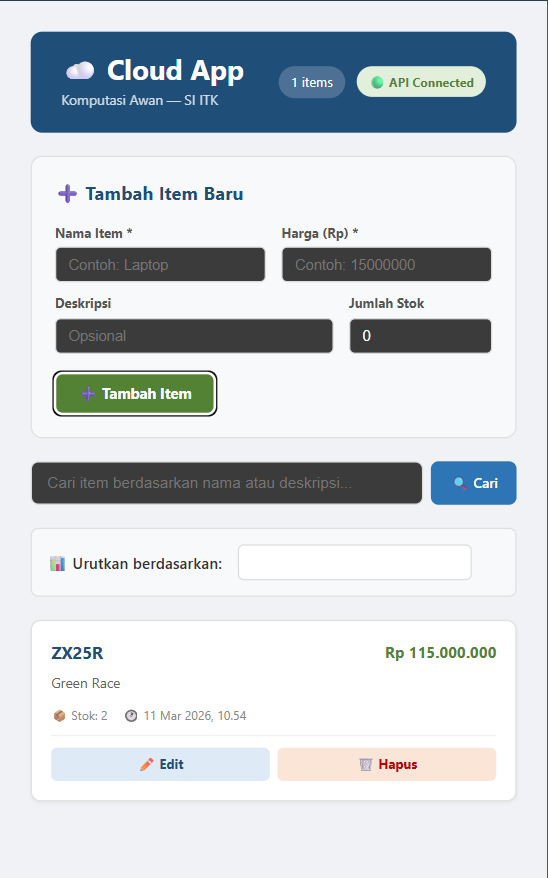

# Laporan Kontribusi Individu: Frontend Development
Nama: [Alfian Fadillah Putra] | NIM: [10231009] | Peran: [Lead Frontend]

## 1. Setup & Inisialisasi (Modul 1)
Inisialisasi proyek dilakukan menggunakan **Vite** dengan template React. Pendekatan ini mempercepat bootstrap aplikasi, menghasilkan bundler yang ringan, dan mendukung hot module replacement yang stabil untuk pengembangan UI.

Struktur `frontend/src` didesain untuk memisahkan tanggung jawab:

- `components/`: Container untuk reusable UI components seperti header, form, list, dan notification.
- `pages/`: Area konsep untuk halaman aplikasi jika dibutuhkan di fase berikutnya, agar navigasi dan route handling tetap terorganisir.
- `services/`: Tempat seluruh integrasi API dan utilitas HTTP.

Contoh struktur folder `frontend/src`:

```
frontend/src/
  components/
    Header.jsx
    ItemCard.jsx
    ItemForm.jsx
    ItemList.jsx
    LoginPage.jsx
    Notification.jsx
    SearchBar.jsx
    SortBar.jsx
  pages/
    Dashboard.jsx
    Login.jsx
  services/
    api.js
  App.jsx
  main.jsx
  index.css
```

## 2. Pengembangan UI & State Management (Modul 3)
Saya mengembangkan minimal tiga reusable components yang berfokus pada komposisi UI dan kemudahan pemeliharaan:

- `Header.jsx` untuk menampilkan status koneksi, jumlah item, dan kontrol logout.
- `ItemForm.jsx` untuk membuat/edit item dengan validasi dasar di sisi klien.
- `ItemList.jsx` bersama `ItemCard.jsx` untuk menampilkan daftar item dan aksi CRUD.
- `SearchBar.jsx` untuk pencarian cepat di daftar data.
- `Notification.jsx` untuk menampilkan feedback operasi secara konsisten.

State management dikendalikan menggunakan React Hooks:

- `useState` digunakan untuk state lokal: `items`, `loading`, `searchQuery`, `isAuthenticated`, `editingItem`, dan toast notification.
- `useEffect` digunakan untuk fetching data saat komponen di-mount dan untuk memeriksa koneksi backend pada awal render.

Form handling diimplementasikan pada `ItemForm.jsx` dengan validasi dasar:

- memeriksa field wajib sebelum submit,
- menampilkan pesan error sederhana,
- menolak submit jika input kosong atau format tidak valid.



## 3. Integrasi API & Autentikasi (Modul 4)
Frontend mengkonsumsi REST API backend menggunakan **Fetch API** untuk semua operasi CRUD:

- `GET /items` untuk membaca data.
- `POST /items` untuk membuat item baru.
- `PUT /items/{id}` untuk memperbarui item.
- `DELETE /items/{id}` untuk menghapus item.

Semua request dikemas melalui helper di `services/api.js` sehingga pengelolaan endpoint dan error handling terpusat.

Alur autentikasi di frontend:

1. User mengirim kredensial login.
2. Backend mengembalikan JWT token.
3. Token disimpan di memori aplikasi melalui helper `setToken()` dan dapat diadaptasi ke `localStorage`/`sessionStorage` untuk persistence.
4. Setiap request dilengkapi header `Authorization: Bearer <token>` dengan utilitas `authHeaders()`.

Implementasi Protected Routes di React:

- Aplikasi menggunakan guard auth dengan state `isAuthenticated`.
- Jika user belum login, komponen utama tidak dirender dan user diarahkan ke halaman login.
- Pola ini setara dengan `ProtectedRoute` pada React Router, di mana render dashboard hanya terjadi bila token valid dan user terautentikasi.

Integrasi `.env` di Vite:

```js
const API_URL = import.meta.env.VITE_API_URL || "http://localhost:8000"
```

Dengan pola ini, URL backend tidak di-hardcode dalam source, dan bisa diubah melalui environment variable saat build atau deploy.

## 4. Containerization Frontend (Modul 5 & 6)
Untuk deployment, frontend dikontainerisasi menggunakan `frontend/Dockerfile` dengan **Multi-stage build**:

- Stage 1 (`node:18-alpine`): install dependensi dan build aplikasi React.
- Stage 2 (`nginx:alpine`): serve hasil build statis dengan Nginx.

Isi `frontend/Dockerfile` lengkap:

```dockerfile
# ============================================================
# Stage 1: Build — Install deps & build React app
# ============================================================
FROM node:18-alpine AS builder

WORKDIR /app

# Copy dependency files dulu (cache optimization)
COPY package.json package-lock.json* ./

# Install dependencies
RUN npm ci

# Copy source code
COPY . .

# Set API URL untuk production build
ARG VITE_API_URL=http://localhost:8000
ENV VITE_API_URL=$VITE_API_URL

# Build React app → output di /app/dist/
RUN npm run build

# ============================================================
# Stage 2: Production — Serve dengan Nginx
# ============================================================
FROM nginx:alpine

COPY --from=builder /app/dist/ /usr/share/nginx/html/
COPY nginx.conf /etc/nginx/conf.d/default.conf

EXPOSE 80

CMD ["nginx", "-g", "daemon off;"]
```

Konfigurasi `nginx.conf` dirancang untuk SPA React agar refresh halaman tidak menghasilkan error 404. Routing SPA ditangani dengan aturan:

- `try_files $uri $uri/ /index.html;`
- Semua permintaan non-asset dialihkan ke `index.html`.

Nginx mengekspos frontend di port **80** dalam container. Ketika container dijalankan di Docker Network, frontend tersedia pada port tersebut dan bisa diakses dari reverse proxy atau dari host jika di-mapping ke port publik.

## 5. Checklist Ketercapaian Frontend (Modul 1-6)
- [x] Inisialisasi React Vite
- [x] Implementasi UI Component & React Hooks
- [x] Fetch API terintegrasi dengan Backend FastAPI
- [x] JWT Auth & Protected Route berjalan di klien
- [x] Dockerfile Frontend dengan Multi-stage build (Node.js + Nginx)
- [x] Image Frontend berukuran kecil (optimized)
